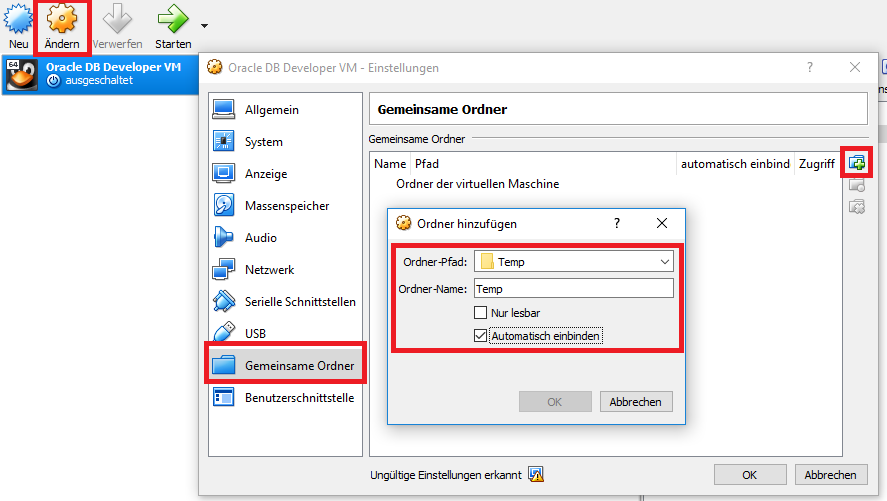

# SQL*Loader in Oracle

## Vorbereitung

Da wir Textdateien direkt mit dem Programm *sqlldr* in der Virtuellen Maschine von Oracle laden möchten,
müssen wir zuerst einen gemeinsamen Ordner mit dem Hostsystem (meist Windows) einrichten. Dafür erstellen
Sie in Windows einen Ordner *C:\Temp*. Danach öffnen Sie VirtualBox und konfigurieren diesen Ordner als
gemeinsamen Ordner:



Wenn Sie nun die virtuelle Maschine starten, können Sie im Terminal mittels des Befehles *cd /media/sf_Temp*
in diesen Ordner wechseln. Mit *ls* können Sie die Dateien auflisten. Falls der Ordner nicht erstellt wird,
können Sie ihn in der Konsole händisch mounten:

```text
su root
cd /mnt/
mkdir sf_Temp
mount -t vboxsf Temp sf_Temp/
```

Nun kann im Ordner */mnt/sf_Temp* auf die Dateien zugegriffen werden.

## Erstellen der Datenbank FahrkartenDb

Zum Beladen verwenden wir wieder die Fahrkarten Datenbank. Diesmal legen wir sie in Oracle an. Dafür
verbinden Sie sich als Systembenutzer in SQL Developer oder DBeaver und legen einen Benutzer
*FahrkartenDb* mit dem Kennwort *oracle* an:

```sql
CREATE USER FahrkartenDb IDENTIFIED BY oracle;
GRANT CONNECT, RESOURCE, CREATE VIEW TO FahrkartenDb;
GRANT UNLIMITED TABLESPACE TO FahrkartenDb;
```

Nachdem der Benutzer angelegt wurde, können Sie in sqldeveloper oder DBeaver eine neue Verbindung
mit diesem Benutzer einrichten. Danach können die Tabellen angelegt werden:

```sql
DROP TABLE Verkauf;
DROP TABLE Kartenart;
DROP TABLE Station;

CREATE TABLE Station (
    ST_ID    INTEGER       PRIMARY KEY,
    ST_Name  VARCHAR2(200) NOT NULL
);

CREATE TABLE Kartenart (
    K_ID          INTEGER         PRIMARY KEY,
    K_Name        VARCHAR2(200)   NOT NULL,
    K_TageGueltig INTEGER         DEFAULT NULL
);

CREATE TABLE Verkauf (
    V_ID        INTEGER  PRIMARY KEY,
    V_Datum     DATE     NOT NULL,
    V_Station   INTEGER  NOT NULL,
    V_Kartenart INTEGER  NOT NULL,
    FOREIGN KEY (V_Station)   REFERENCES Station(ST_ID),
    FOREIGN KEY (V_Kartenart) REFERENCES Kartenart(K_ID)
);
COMMIT;
```

## Laden der Daten aus den Textdateien

Im Ordner [02_SqlLoader](02_SqlLoader) verschiedene Textdateien enthalten: *station.txt*, *kartenart.txt* und 3 Dateien
mit dem Namen *verkaeufeNN.txt*. Diese Dateien sollen mit dem SQL Loader geladen werden.

### Laden der Stationen

Für die erste Datei (*station.txt*) erstellen wir ein Control file im Texteditor, welches folgenden Aufbau 
hat:

```text
OPTIONS (SKIP=1)
LOAD DATA
INFILE 'station.txt' "STR '\r\n'"
INTO TABLE Station
APPEND
FIELDS TERMINATED BY '\t' (
    ST_ID,
    ST_Name
)
```

Nachdem das Control file unter *station.ctl* in *C:\Temp* gespeichert wurde, kann in der virtuellen Maschine
der Befehl

```text
sqlldr userid=FahrkartenDb/oracle control=station.ctl
```

ausgeführt werden. Ändern Sie den Namen eines Bahnhofes und laden Sie erneut. Was passiert? Ersetzen Sie 
nun in der Datei *station.ctl* das Wort *APPEND* durch *REPLACE*. Danach entfernen Sie einen Bahnhof 
in der Datei *station.txt*. Was passiert?

### Laden der Kartenarten

Für den Import von *kartenart.txt* verwenden Sie folgendes Control file:

```text
OPTIONS (SKIP=1)
LOAD DATA
INFILE 'kartenart.txt' "STR '\r\n'"
INTO TABLE Kartenart
REPLACE
FIELDS TERMINATED BY '\t' (
    K_ID,
    K_Name,
    K_TageGueltig "CASE WHEN :K_TageGueltig = 'NULL' THEN NULL ELSE TO_NUMBER(:K_TageGueltig) END"
)
```

### Laden der Verkäufe

Die Verkäufe sind in 3 Dateien aufgeteilt. Diese werden mit folgendem Control file, welches Sie unter
*verkauf.ctl* speichern können, importiert:

```text
OPTIONS (SKIP=1)
LOAD DATA
INFILE 'verkaeufe*.txt' "STR '\r\n'"
INTO TABLE Verkauf
REPLACE
FIELDS TERMINATED BY '\t' (
    V_ID,
    V_Datum "TO_DATE(:V_Datum,'YYYY-MM-DD\"T\"HH24:MI:SS')",
    V_Wochentag FILLER,
    V_Stunde    FILLER,
    V_Station,
    V_Kartenart
)
```

## Weitere Informationen

- Oracle SQL*Loader Control File Reference: https://docs.oracle.com/cd/B28359_01/server.111/b28319/ldr_control_file.htm
- Loading Examples: https://docs.oracle.com/cd/B10500_01/text.920/a96518/aload.htm
