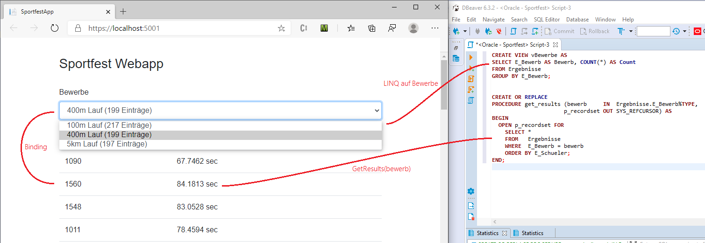

# Zugriff auf die Oracle Datenbank mit EF Core

> **Hinweis:** Sie benötigen eine virtuelle Maschine mit Oracle 12 und 64bit. Der Oracle Treiber für
> EF Core funktioniert erst ab der Version 11.2.
> Die Anleitung zur Installation der Oracle 12 VM ist im Ordner [Oracle VM](../02_OracleVM/README.md)
> zu finden.

Kontrollieren Sie, ob Sie die benötigten Schritte aus dem Kapitel
[Download und Konfiguration der VM](../02_OracleVM/README.md) (Portforwarding, gemeinsamer Ordner, ...)
durchgeführt haben.

## Installieren der EF Core Tools

Stellen Sie mit folgendem Befehl zuerst fest, welche Version von .NET Core Sie installiert haben.

```text
dotnet --info
```

Führen Sie nun in der Konsole den folgenden Befehl aus. Er installiert die EF Core Tools. Durch diese
Tools können wir im nächsten Punkt die Modelklassen aus der bestehenden Datenbank generieren.

```text
dotnet tool update --global dotnet-ef
```

> **Hinweis:** Nach der Installation der ef Tools muss die Konsole neu geöffnet werden, da die *PATH*
> Variable geändert wurde.

## Erstellen eines Users und Befüllen der Datenbank

Als Ausgangsbasis verwenden wir die bei den analytischen Funktionen verwendete Sportfestdatenbank.
Erstellen Sie zuerst einen neuen User *Sportfest* mit folgenden Berechtigungen:

```sql
DROP USER Sportfest CASCADE;

CREATE USER Sportfest IDENTIFIED BY oracle;
GRANT CONNECT, RESOURCE, CREATE VIEW TO Sportfest;
GRANT UNLIMITED TABLESPACE TO Sportfest;
```

Verbinden Sie sich nun mit diesem User in SQL Developer oder DBeaver
(Anleitung im Kapitel [DBeaver](../01_Dbeaver/README.md)) und führen das
[SQL Skript aus dem Kapitel Analytische Funktionen](sportfest.sql)
aus.

## Erstellen einer Konsolenapplikation mit EF Core

Geben Sie nun in der Konsole in ein Verzeichnis Ihrer Wahl. Führen Sie danach die folgenden
Befehle aus. Diese Befehle funktionieren auch unter Linux oder macOS. Ihre virtuelle Maschine mit
der Oracle Datenbank muss für den letzten Befehl gestartet und bereit sein. Prüfen Sie das am Besten
vorher in DBeaver.

```text
rd /S /Q SportfestApp
md SportfestApp
cd SportfestApp
dotnet new console
dotnet add package Microsoft.EntityFrameworkCore.Tools
dotnet add package Oracle.EntityFrameworkCore
dotnet run
dotnet ef dbcontext scaffold  "User Id=Sportfest;Password=oracle;Data Source=localhost:1521/orcl" Oracle.EntityFrameworkCore --output-dir Model --force --data-annotations

```

Die einzelnen Befehle bewirken folgendes:

- *dotnet new console* erzeugt eine leere .NET Core Konsolenanwendung. Es ist vergleichbar mit
  *Neues Projekt* - *Konsolenanwendung* in Visual Studio.
- *dotnet add package* fügt zu diesem Projekt NuGet Pakete hinzu. Es ist vergleichbar mit *NuGet* -
  *Manage Packages* in Visual Studio. Da das Oracle EFCore Paket im Moment noch nicht mit der
  Version 3 kompatibel ist, wird die neuste Version von EFCore 2 (2.2.6) eingebunden.
  Danach wird der Oracle Datenbanktreiber installiert.
- *dotnet ef dbcontext scaffold* erzeugt die Modelklassen aus der Datenbank. Dabei verweist der
  Verbindungsstring auf localhost. Falls Sie auf Ihre VM mittels IP Adresse zugreifen, ist dies durch
  die IP zu ersetzen.

Öffnen Sie nun die Datei SportfestApp.csproj in Visual Studio. In der Konsole können Sie dies mit
*start SportfestApp.csproj* am Schnellsten erledigen.

### Testen des Datenbankzugriffes

Zum Testen führen wir in unserem Programm nun eine kleine Abfrage aus, indem Sie die *Main* Methode
durch den folgenden Code ersetzen. Vergessen Sie nicht die in den Kommentar angegebenen *using*
Anweisungen einzubinden. Starten Sie das Programm einfach mit *F5* in Visual Studio oder
*dotnet run* in der Konsole.

```c#
static void Main(string[] args)
{
    using (ModelContext db = new ModelContext())    // using SportfestApp.Model oder STRG + . in VS
    {
        var schueler1a = from s in db.Schueler      // using System.Linq
                            where s.SKlasse == "1AHIF"
                            orderby s.SId
                            select new
                            {
                                Id = s.SId,
                                Zuname = s.SZuname
                            };

        Console.WriteLine("SCHÜLER DER 1AHIF");
        foreach (var s in schueler1a)
        {
            Console.WriteLine($"{s.Id} {s.Zuname}");
        }
    }
}
```

Das Programm soll folgende Ausgabe liefern:

```text
SCHÜLER DER 1AHIF
1001 Zuname1001
1002 Zuname1002
1003 Zuname1003
1004 Zuname1004
1005 Zuname1005
```

## Zugreifen auf Views

Erstellen Sie in der Datenbank folgende View und prüfen Sie das Ergebnis:

```sql
CREATE VIEW vBewerbe AS
SELECT E_Bewerb AS Bewerb, COUNT(*) AS Count
FROM Ergebnisse
GROUP BY E_Bewerb;

-- | BEWERB    | COUNT |
-- | --------- | ----- |
-- | 100m Lauf | 217   |
-- | 5km Lauf  | 197   |
-- | 400m Lauf | 199   |
SELECT * FROM vBewerbe;
```

Um nun auf unsere View zugreifen zu können, müssen folgende Schritte erledigt werden.

### Erstellen der Modelklasse

Für unsere Tabellen hat das *scaffold* Skript die Tabellendefinitionen erstellt. Bei Views
müssen wir selbst die Modelklasse erstellen. Diese Klasse verbindet das Ergebnis mit der
View mit der objektorientierten Welt in C#.

EF Core arbeitet nach dem *convention over configuration* Prinzip. Das bedeutet, dass ein bestimmtes
Standardverhalten keiner Konfiguration im Code bedarf. Das Standardverhalten lautet:

- Der Tabellenname entspricht dem Typnamen der Modelklasse
- Die Felder in der Tabelle entsprechen dem Namen der Properties in dieser Klasse

Allerdings trifft dies bei uns nicht zu, denn

- unsere View heißt vBewerbe und nicht Bewerb.
- der OR Mapper für Oracle setzt alle Objektnamen in der Datenbank als großgeschrieben um.

Dadurch ist es notwendig, die einzelnen Codeelemente mit Annotations (vergleichbar mit @ in Java)
zu versehen. Erstellen Sie eine neue Klasse mit dem Namen *Bewerb* im Ordner *Model* und fügen Sie
den untenstehenden Code ein.

```c#
using System;
using System.Collections.Generic;
using System.ComponentModel.DataAnnotations.Schema;
using System.Text;

namespace SportfestApp.Model
{
    [Keyless]
    [Table("VBEWERBE")]     // using System.ComponentModel.DataAnnotations.Schema oder STRG + . in VS
    public class Bewerb
    {
        [Column("BEWERB")]
        public string Name { get; set; }
        [Column("COUNT")]
        public int Count { get; set; }
    }
}
```

### Anpassen des Contextes

Eine Modelklasse alleine gibt nur an, wie EF Code den Rückgabewert der Abfrage mappen soll. Damit
wir die View abfragen können, muss die Klasse *ModelContext* noch editiert werden. Der nachfolgende
Code gibt die Ergänzung in der Klasse an. Der Rest bleibt unverändert.


```c#
public partial class ModelContext : DbContext
{
    // Andere Tabellen
    public virtual DbSet<Bewerb> Bewerbe { get; set; }
}
```

### Verwenden der View

Nun können Sie die *Main* Methode in *Program.cs* ergänzen.

```c#
using (ModelContext db = new ModelContext())
{
    // Code aus der vorigen Übung
    Console.WriteLine("BEWERBE IN DER DATENBANK");
    var bewerbe = from b in db.Bewerbe
                    select b;
    foreach (var b in bewerbe)
    {
        Console.WriteLine($"{b.Name} hat {b.Count} Einträge.");
    }
}
```

Dieses Codestück soll folgende Ausgabe liefern:

```text
BEWERBE IN DER DATENBANK
100m Lauf hat 217 Einträge.
5km Lauf hat 197 Einträge.
400m Lauf hat 199 Einträge.
```

## Zugreifen auf Stored Procedures

Legen Sie in der Sportfestdatenbank eine Prozedur mit dem Namen *get_results* an. Diese
Prozedur liest Werte aus der Datenbank in einen Cursor. Dieser Cursor wird als*OUT* Parameter
an unsere Applikation geliefert.

```sql
CREATE OR REPLACE
PROCEDURE get_results (bewerb     IN  Ergebnisse.E_Bewerb%TYPE,
                      p_recordset OUT SYS_REFCURSOR) AS
BEGIN
  OPEN p_recordset FOR
    SELECT *
    FROM   Ergebnisse
    WHERE  E_Bewerb = bewerb
    ORDER BY E_Schueler;
END;
```

### Testen in der Mainmethode

Nun rufen wir die Prozedur auf. Da sie nur einen Teil der Tabelle *Ergebnisse* liefert, muss
keine neue Modelklasse definiert werden. Die Methode *FromSql()* bedeutet, dass EF Core diese
Anweisung ausführt und versucht, das Ergebnis auf die entsprechende Modelklasse zu mappen.

Da wir auch mit Parametern arbeiten, definieren wir sie zuerst mit einem Namen (*:bewerb*, ...).
Die weiteren Argumente spezifizieren dann den Typ und den Wert für unsere Parameter.

Fügen Sie in Ihre *Main* Methode in der Datei *Program.cs* folgenden Code ein.

```c#
using (ModelContext db = new ModelContext())
{
    // Code aus der vorigen Übung

    // using System.Data;
    // using Microsoft.EntityFrameworkCore
    // using Oracle.ManagedDataAccess.Client
    var results = db.Ergebnisse.FromSqlRaw("BEGIN get_results(:bewerb, :result); END;",
        new OracleParameter("bewerb", "100m Lauf"),
        new OracleParameter("result", OracleDbType.RefCursor, ParameterDirection.Output)).AsEnumerable();

    Console.WriteLine($"{results.Count()} Bewerbe gefunden.");
}
```

### Einbauen in den Context

Die vorige Technik funktioniert zwar, ist aber - wenn die Prozedur mehrmals aufgerufen werden
soll - sperrig. Außerdem ist keine Typprüfung des Parameters *bewerb* möglich, da er als
*object* übergeben wird.

Wir wollen nun unsere Klasse *ModelContext* durch eine C# Funktion *GetResults*
erweitern, die genau den oberen Code aufruft. *FromSql()* liefert ein Ergebnis des Typs
*IQueryable&lt;T&gt;*. Diesen Rückgabewert geben wir
auch unserer Funktion. Der *=&gt;* Operator ermöglicht ab C# 7 das Einsparen des *return*
Statements und gibt automatisch das Ergebnis zurück.

```c#
using System.Data;
using Microsoft.EntityFrameworkCore;
using Oracle.ManagedDataAccess.Client;
using System.Collections.Generic;

namespace SportfestApp.Model
{
    public partial class ModelContext : DbContext
    {
        public IEnumerable<Ergebnisse> GetResults(string bewerb) =>
            Ergebnisses.FromSqlRaw("BEGIN get_results(:bewerb, :result); END;",
                                new OracleParameter("bewerb", bewerb),
                                new OracleParameter("result", OracleDbType.RefCursor, ParameterDirection.Output));
    }
}
```

Nun kann in der Main Methode einfach die Prozedur über die Contextklasse aufgerufen werden:

```c#
var results = db.GetResults("100m Lauf");
```

## Übung

Wir wollen nun für eine bestimmte Klasse das Ranking pro Bewerb ermitteln. Dafür können wir die
analytischen Funktionen einsetzen:

```sql
SELECT 
    S_ID, S_Zuname, E_Bewerb, E_Zeit,
    RANK() OVER (PARTITION BY E_Bewerb ORDER BY E_Zeit) AS Rang
FROM Schueler INNER JOIN Ergebnisse ON (S_ID = E_Schueler)
WHERE S_Klasse = '1AHIF';
```

Nun soll das Ergebnis durch eine PL/SQL Prozedur geliefert werden. Diese Prozedur hat einen *IN*
Parameter (*klasse*) und gibt das Ergebnis zurück. Geben Sie dabei so vor:

1. Schreiben Sie die Prozedur *get_ranking* und erstellen Sie sie in der Datenbank. Verwenden Sie
   als Basis die oben angezeigte SQL Abfrage, ersetzen Sie allerdings die Klasse durch den Parameter
   der Prozedur.
2. Da die Prozedur eine vom Aufbau her eigene Tabelle zurückgibt, müssen Sie die Modelklasse dafür
   schreiben. Dafür erstellen Sie im Ordner *Model* eine neue Klasse *Rank*. Achten Sie beim Mapping
   darauf, dass Sie die korrekten *Column* Annotations setzen.
3. Registrieren Sie ihre Modelklasse - wie bei der View - als *DbSet&lt;Rank&gt;*
   Property in Ihrem
   Context. Am Besten Sie benennen das Property nach der Mehrzahl (*Ranks*), damit keine Kollisionen
   mit dem Typnamen entstehen.
4. Erstellen Sie eine Methode `public IEnumberable<Rank> GetRanking(string klasse)` im Context, die
   mit der FromSql() Funktion das Ergebnis der Prozedur liefert.
5. Rufen Sie in Ihrer *Main* Methode die Funktion *GetRanking* mit folgendem Code auf. Das Ergebnis
   muss dann der untenstehenden Ausgabe entsprechen. Falls Sie andere Bezeichnungen für die Spalten
   in der Modelklasse gewählt haben, ist der Code natürlich anzupassen.

```c#
var ranking = db.GetRanking("1AFIT")
                .Where(r=> r.Rang <= 3)
                .OrderBy(r => r.EBewerb);
foreach (Rank r in ranking)
{
    Console.WriteLine($"Platz {r.Rang} im Bewerb {r.EBewerb} hat {r.SZuname} mit {r.EZeit} s");
}
```

```text
Platz 1 im Bewerb 100m Lauf hat Zuname1015 mit 9.9832 s
Platz 2 im Bewerb 100m Lauf hat Zuname1012 mit 12.6026 s
Platz 3 im Bewerb 100m Lauf hat Zuname1011 mit 12.9620 s
Platz 1 im Bewerb 400m Lauf hat Zuname1014 mit 59.3951 s
Platz 2 im Bewerb 400m Lauf hat Zuname1011 mit 61.1649 s
Platz 3 im Bewerb 400m Lauf hat Zuname1015 mit 63.2361 s
Platz 1 im Bewerb 5km Lauf hat Zuname1011 mit 1248.8879 s
Platz 2 im Bewerb 5km Lauf hat Zuname1012 mit 1252.5676 s
Platz 3 im Bewerb 5km Lauf hat Zuname1011 mit 1422.9360 s
```

## Für interessierte: Erstellen einer kleinen Webapplikation für die Daten

Mit Blazor können Sie natürlich auch auf die Datenbank zugreifen. Zum Erstellen der Applikation werden
fast die selben Befehle verwendet, nur wird statt *console* das Temlate *blazorserver* eingegeben.



```text
rd /S /Q SportfestApp
md SportfestApp
cd SportfestApp
dotnet new blazorserver
dotnet add package Microsoft.EntityFrameworkCore.Tools --version 2.2.6
dotnet add package Oracle.EntityFrameworkCore
dotnet ef dbcontext scaffold  "User Id=Sportfest;Password=oracle;Data Source=localhost:1521/orcl" Oracle.EntityFrameworkCore --output-dir Model --force --data-annotations

```

Öffnen Sie danach die Datei *SportfestApp.csproj* in Visual Studio. Führen Sie danach die oben
beschriebenen Schritte in den Modelklassen durch, damit die Verbindung zur View und zur Prozedur
hergestellt wird.

Ergänzen Sie dann in der Methode *ConfigureServices* in *Startup.cs* den Datenbankkontext:

```c#
public void ConfigureServices(IServiceCollection services)
{
    // Andere Services (AddRazorPages, AddServerSideBlazor)
    services.AddDbContext<ModelContext>();
}
```

Fügen Sie in der Datei *_Imports.razor* das Using für Ihr Model ein:

```c#
@using SportfestApp.Model;
```

Ersetzen Sie in der Datei *Pages/Index.razor* den Inhalt durch den folgenden Code.

```c#
@page "/"
@inject ModelContext Context;

<div class="form-group">
    <label for="bewerbList">Bewerbe</label>
    <select class="form-control" id="bewerbList" @bind="@SelectedBewerb">
        @foreach (var bewerb in @Bewerbe)
        {
            <option value=@bewerb.Name>@bewerb.Name (@bewerb.Count Einträge)</option>
        }
    </select>
</div>
<div>
    <table class="table">
        @if (SelectedBewerb != "")
        {
            <thead>
                <tr><td>E-ID</td><td>Zeit</td></tr>
            </thead>
        }

        @foreach (var ergebnis in Ergebnisse)
        {
            <tr><td>@ergebnis.EId</td><td>@ergebnis.EZeit sec</td></tr>
        }
    </table>

</div>
@code
{
    private List<Bewerb> Bewerbe { get; set; } = new List<Bewerb>();
    private string _selectedbewerb = "";
    private string SelectedBewerb
    {
        get => _selectedbewerb;
        set
        {
            Ergebnisse = Context.GetResults(value).ToList();
            _selectedbewerb = value;
        }
    }
    private List<Ergebnisse> Ergebnisse { get; set; } = new List<Ergebnisse>();

    protected override void OnInitialized()
    {
        Bewerbe = (from b in Context.Bewerbe
                   orderby b.Name
                   select b).ToList();
    }
}
```

## Weitere Informationen

- [oracle.com: .NET Development with Oracle Database](https://www.oracle.com/technetwork/topics/dotnet/latest-news/index.html)
