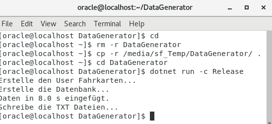

# SQL*Loader in Oracle

> **Hinweis:** Sie benötigen einen gestarteten Docker Container mit Oracle 19 bzw. 21. 
> Die Anleitung zur Installation befindet sich auf https://github.com/schletz/Dbi2Sem/tree/master/01_OracleVM/03_Docker.

Das *docker run* Kommando aus der Anleitung ist

```
docker run -d -p 1521:1521 -e ORACLE_PASSWORD=oracle -v C:/Temp/oracle-home:/host --name oracle21c gvenzl/oracle-xe:21-full
```

Voraussetzung für diesen Punkt ist, dass *C:\Temp\oracle-home* im Docker Container (Oracle 21) sichtbar ist.
Öffnen Sie daher das Terminal *des Oracle Containers* und geben Sie die folgenden Befehle ein:

```
cd /host
echo "Hello from Oracle" > test.txt
```

Sie sehen nun in *C:\Temp\oracle-home* die Datei *test.txt*.

## Erstellen der Fahrkarten Datenbank mit dem DataGenerator

Das Programm [DataGenerator](DataGenerator) erzeugt eine kleine Datenbank, die
Fahrkartenverkäufe speichert. Außerdem werden Musterdaten in die Tabellen sowie in Textdateien
geschrieben, sodass wir Daten zum Importieren haben.

Um die Datenbank zu erzeugen, klonen Sie dieses Repository (`git clone https://github.com/schletz/Dbi4Sem`) und gehen Sie in das Verzeichnis *12_SqlLoader/DataGenerator*.
Danach führen Sie den folgenden Befehl aus, um 1000000 (1 Million) Datensätze zu generieren:

```
dotnet run -c Release 1000000
```

Je nach Leistung des Rechners kann dies ca. 3 Minuten dauern.
Notieren Sie sich die Zeit, wir werden sie nachher mit unserer SQL*Loader Lösung vergleichen.
Danach kopieren Sie die erzeugten Textdateien (*stations.txt*, *kartenarten.txt* und *verkaufe[1-3].txt*) in das Verzeichnis *C:\Temp\oracle-home*.

### Optional: Kompilieren des DataGenerators für Linux

Dieser Punkt soll nur die Möglichkeit zeigen, dass Sie das Programm auch im Container ausführen können.
Er ist für die weiteren Schritte nicht erforderlich.

Da der DataGenerator ein .NET 6 Programm ist, können Sie unter Windows das Programm für
Linux kompilieren. Dafür gehen Sie in der Windows Konsole in das Verzeichnis mit dem DataGenerator
Führen Sie den folgenden Befehl aus:

```text
dotnet publish -c Release -o C:/Temp/oracle-home/DataGeneratorBuild -r linux-x64 --self-contained
```

Nun wechseln Sie in das Verzeichnis */host* und führen das kompilierte Programm einfach aus:

**Oracle 21 (Docker Image)**
```text
export DOTNET_SYSTEM_GLOBALIZATION_INVARIANT=1
cd /host
./DataGeneratorBuild/DataGenerator 10000
```

Das Programm erstellt nun den Oracle User *Fahrkarten*, erstellt die Datenbank und fügt Musterdaten
für unsere Fahrkartenverkäufe ein. Der Parameter (10000) gibt die Anzahl der zu generierenden
Verkäufe ein. Setzen Sie ihn so, dass das Programm in etwa 30 Sekunden benötigt.



### Erstelle Tabellen

```sql
CREATE TABLE KARTENART (
    KARTENART_ID NUMBER(10,0)  PRIMARY KEY,
    NAME         VARCHAR2(200) NOT NULL,
    TAGEGUELTIG  NUMBER(10,0),
    PREIS        NUMBER(18,4)
);

CREATE TABLE STATION (
    STATION_ID NUMBER(10,0)   PRIMARY KEY,
    NAME       VARCHAR2(200)  NOT NULL,
    LATITUDE   NUMBER(18,15)  NOT NULL,
    LONGITUDE  NUMBER(18,15)  NOT NULL
);

CREATE TABLE VERKAUF (
  VERKAUF_ID NUMBER(10,0) PRIMARY KEY,
  DATUM      TIMESTAMP    NOT NULL,
  STATION    NUMBER(10,0) NOT NULL REFERENCES STATION(STATION_ID),
  KARTENART  NUMBER(10,0) NOT NULL REFERENCES KARTENART(KARTENART_ID)
);
```

## Beladen mit SQL*Loader

### Allgemeines zum Importieren von Textdateien

Textdateien importieren klingt einfacher als es ist. Bevor eine Datei importiert wird, müssen
folgende Parameter ermittelt werden:

- Trennzeichen oder fixe Breite?
- Kopfzeile ja oder nein?
- Zeilenumbruch (Windows: CR+LF, Linux: LF, macOS: CR)?
- Zeichensatz (UTF8, ISO 8859-x, Ansi Windows-1252, ...)?
- Kommazeichen (, oder .)?
- Datumsformat?
- Strings unter Anführungszeichen (damit das Trennzeichen dort vorkommen kann)?
- Wie werden NULL Werte gekennzeichnet (leer, Wort "NULL", ...)?

Die Hersteller der Datenbanksysteme bieten verschiedene Tools an, mit denen Textdateien effizient
(= schnell) gelesen werden können. Die Tools sind zwar unterschiedlich, bieten aber alle in einer
Form Optionen an, um die obigen Parameter einstellen zu können.

In Oracle ist das Tool SQL*Loader für den Import von Textdateien zuständig. Es bietet mit dem
sogenannten *control file* eine Möglichkeit an, die Textdatei zu beschreiben.

### Löschen der Musterdaten

Bevor wir die Daten in unsere Datenbank importieren, müssen wir die Daten, die durch
das Importprogramm geschrieben wurden, löschen. Dafür starten Sie *sqlplus* mit dem entsprechenden
User und geben Sie die DELETE Kommandos mit:

**Oracle 19/21**
```bash
sqlplus Fahrkarten/oracle@//localhost/XEPDB1 <<< "
    DELETE FROM Verkauf;
    DELETE FROM Station;
    DELETE FROM Kartenart;"
```

### Laden der Stationen

Nun wollen wir die Datei mit den Stationen importieren. Dafür können Sie sich mit folgendem Befehl
die ersten Zeilen der Datei ansehen:

```bash
head stations.txt
```

Für die Datei (*stations.txt*) erstellen wir nun ein Control file. Dazu starten Sie mit einem
Texteditor im Verzeichnis *C:\Temp\oracle-home* die Datei *station.ctl*. Legen Sie den Zeilenumbruch
auf LF fest, da das Skript unter Linux ausgeführt wird. Kopieren die folgenden Befehle in die
erstellte Datei:

```text
OPTIONS (SKIP=1)
LOAD DATA
CHARACTERSET UTF8
INFILE 'stations.txt' "STR '\r\n'"
INTO TABLE Station
APPEND
FIELDS TERMINATED BY '\t'
(
    STATION_ID,
    NAME,
    LATITUDE,
    LONGITUDE
)

```

Die Optionen im control file sind durch ihre Übersetzung schon weitgehend nachvollziehbar:

- *OPTIONS (SKIP=1)* bedeutet, dass die erste Zeile (Kopfzeile) einfach überlesen wird.
- *CHARACTERSET UTF8* gibt an, dass die Datei UTF-8 codiert ist.
- *INFILE 'stations.txt' "STR '`\r\n`'"* gibt den Namen der Textdatei an, die geladen werden soll.
  Außerdem wird der verwendete Zeilenumbruch (CR+LF) als Zeilenumbruch eingestellt.
- *APPEND* bedeutet, dass die Daten an die Tabelle angehängt werden.
- *FIELDS TERMINATED BY '`\t`'* legt den Tabulator (`\t`) als Trennzeichen fest.
- Die *Feldliste* orientiert sich an den Spaltennamen in der Tabelle. Der erste Wert in der
  Textdatei wird in die erste Spalte in der Liste geschrieben usw.

Nun kann im Terminal des Containers mit folgendem Befehl der Import gestartet werden:

**Oracle 19/21**
```text
sqlldr userid=Fahrkarten/oracle@//localhost/XEPDB1 control=station.ctl

```

Führen Sie nun den Befehl nochmals aus. Was passiert? Betrachten Sie die Ausgabedatei für
fehlerhafte Daten mit *more stations.bad*.Ersetzen Sie nun in der Datei *station.ctl* das Wort
*APPEND* durch *REPLACE*. Was passiert?

### Laden der Kartenarten

Für den Import von *kartenart.txt* erstellen Sie folgendes Control file *kartenart.ctl*:

```text
OPTIONS (SKIP=1)
LOAD DATA
CHARACTERSET UTF8
INFILE 'kartenarten.txt' "STR '\r\n'"
INTO TABLE Kartenart
REPLACE
FIELDS TERMINATED BY '\t'
(
    KARTENART_ID,
    NAME,
    TAGEGUELTIG "CASE WHEN :TAGEGUELTIG = 'N/A' THEN NULL ELSE TO_NUMBER(:TAGEGUELTIG) END",
    PREIS
)

```

Es fällt folgende Erweiterung auf: Die Preise haben manchmal den Wert *N/A* in der Textdatei.
Ohne spezielle Optionen würde SQL*Loader versuchen, diesen Wert in eine Zahl umzuwandeln, was
natürlich scheitert. Daher können wir ein kleines Stück Logik vorschalten, welche den
gelesenen Wert noch anpasst. Führen Sie die Datei nun aus:

**Oracle 19/21**
```text
sqlldr userid=Fahrkarten/oracle@//localhost/XEPDB1 control=kartenart.ctl
```

Betrachten Sie genau die Ausgabe. Wie viele Zeilen wurden geladen? Gibt es Daten in der Datei
*kartenarten.bad*? Welche Ursache könnte das haben?

Am Ende der letzten Zeile wurde ein NULL Wert als leerer Wert gespeichert. Deswegen muss die
Option *TRAILING NULLCOLS* eingefügt werden, damit NULL Spalten am Ende auch erkannt werden:

```text
OPTIONS (SKIP=1)
LOAD DATA
CHARACTERSET UTF8
INFILE 'kartenarten.txt' "STR '\r\n'"
INTO TABLE Kartenart
REPLACE
FIELDS TERMINATED BY '\t'
TRAILING NULLCOLS
(
    KARTENART_ID,
    NAME,
    TAGEGUELTIG "CASE WHEN :TAGEGUELTIG = 'N/A' THEN NULL ELSE TO_NUMBER(:TAGEGUELTIG) END",
    PREIS
)
```

### Laden der Verkäufe

Die Verkäufe sind in 3 Dateien aufgeteilt. Diese werden mit folgendem Control file, welches Sie unter
*verkauf.ctl* speichern können, importiert:

```text
OPTIONS (SKIP=1)
LOAD DATA
INFILE 'verkaeufe*.txt' "STR '\r\n'"
INTO TABLE Verkauf
REPLACE
FIELDS TERMINATED BY '\t' (
    VERKAUF_ID,
    DATUM       "TO_DATE(:DATUM,'YYYY-MM-DD\"T\"HH24:MI:SS')",
    IGNORE01    FILLER,
    IGNORE02    FILLER,
    STATION,
    KARTENART
)

```

**Oracle 19/21**
```text
sqlldr userid=Fahrkarten/oracle@//localhost/XEPDB1 control=verkauf.ctl

```

Die Besonderheit in diesem control file sind die *FILLER* Spalten. Unsere Textdatei hat nämlich
Spalten, die nicht in der Tabelle vorkommen (Wochentag und Stunde). Wir definieren also dummy
Spalten (die Benennung ist egal, es muss nicht *IGNORE01* heißen) und versehen sie mit dem
Hinweis *FILLER*.

### Shellscript mit allen Importen

Erstellen Sie eine neue Datei mit dem Namen *import.sh*. Achten Sie auch hier auf den
korrekten Zeilenumbruch (LF). Fügen Sie die folgenden Befehle ein:

**Oracle 19/21**
```bash
sqlldr userid=Fahrkarten/oracle@//localhost/XEPDB1 control=station.ctl
sqlldr userid=Fahrkarten/oracle@//localhost/XEPDB1 control=kartenart.ctl
sqlldr userid=Fahrkarten/oracle@//localhost/XEPDB1 control=verkauf.ctl

```

Um das Shellscript ausführen zu können, müssen Sie zuerst die Ausführungsrechte setzen. Mit dem
Kommando *time* kann die Laufzeit eines Skriptes bestimmt werden-

```bash
chmod a+x import.sh
time ./import.sh
```

Wie lange hat der Import mit SQL*Loader gedauert? Um welchen Faktor war der Import schneller?

## Weitere Informationen

- Oracle SQL*Loader Control File Reference: https://docs.oracle.com/cd/B28359_01/server.111/b28319/ldr_control_file.htm
- Loading Examples: https://docs.oracle.com/cd/B10500_01/text.920/a96518/aload.htm
- Character Sets: https://docs.oracle.com/cd/E41633_01/pt853pbh1/eng/pt/tgbl/concept_UnderstandingCharacterSets-0769d6.html
