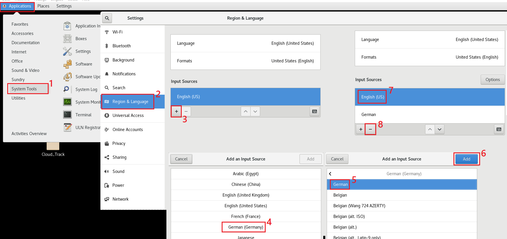
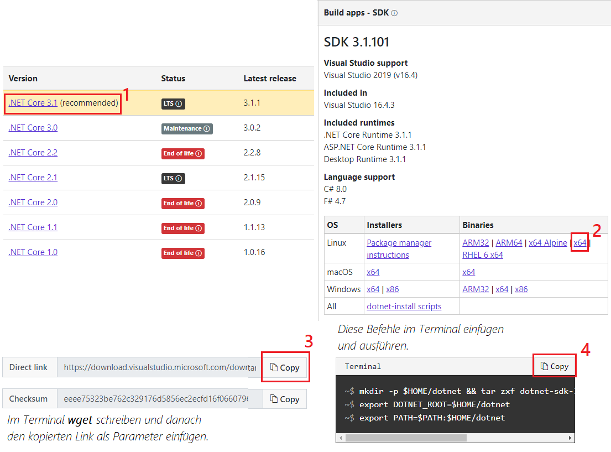
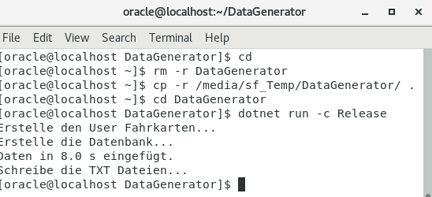

# SQL*Loader in Oracle

## Vorbereitung der virtuellen Maschine

Starten Sie die virtuelle Maschine und führen Sie danach die Konfigurationsschritte dort durch.

### Deutsches Tastaturlayout

Unter *System Tools - Region & Language - Input Sources* können Sie das deutsche Tastaturlayout
festlegen.



### Installation von .NET Core SDK für Linux

Besuchen Sie die .NET Core Downloadseite unter
[dotnet.microsoft.com](https://dotnet.microsoft.com/download/dotnet-core).



Wählen Sie die neuste .NET Version (1) und danach im Bereich SDK unter Linux die Binaries für
x64 (2). Es öffnet sich ein Downloaddialog, den sie aber abbrechen. Wir wollen nämlich das Paket in
unserer VM direkt laden.

Dafür kopieren Sie den angebotenen Direct link mit dem Copy Button (3) in die Zwischenablage. Nun
wechseln Sie mit *cd* im Terminal in Ihr Homeverzeichnis. Danach schreiben Sie im Terminal den
Befehl *wget* und fügen den kopierten Link nach einer Leerstelle ein (rechte Maustaste und *Paste*).

Nun kopieren Sie die Befehle für die Installation mit dem Copy Button (4) in die Zwischenablage und
führen Sie diese im Terminal aus. Prüfen Sie mit dem Befehl *dotnet --info*, ob die Installation
geklappt hat.

Damit der Pfad zur .NET Installation automatisch durchsucht wird. müssen Sie die Datei
*.bash_profile* in ihrem Homeverzeichnis editieren. Starten Sie hierfür den Editor nano mit folgenden
Befehlen im Terminal:

```bash
cd
nano .bash_profile

```

Suchen Sie nach der Zeile, die die Veriable *PATH* definiert und fügen Sie nach einem Doppelpunkt
*$HOME/dotnet* an:

```bash
PATH=$PATH:$HOME/.local/bin:$HOME/bin:$HOME/dotnet
```

Sie beenden den Editor, indem Sie *CTRL + X*, danach *y* und *ENTER* drücken.

### Gemeinsamer Ordner

Da wir Textdateien direkt mit dem Programm *sqlldr* in der Virtuellen Maschine von Oracle laden möchten,
müssen wir zuerst einen gemeinsamen Ordner mit dem Hostsystem (meist Windows) einrichten. Dafür erstellen
Sie in Windows einen Ordner *C:\Temp*. Danach öffnen Sie VirtualBox und konfigurieren diesen Ordner als
gemeinsamen Ordner:


Wenn Sie nun die virtuelle Maschine starten, können Sie im Terminal mittels des Befehles *cd /media/sf_Temp*
in diesen Ordner wechseln. Mit *ls* können Sie die Dateien auflisten. Falls der Ordner nicht erstellt wird,
können Sie ihn in der Konsole händisch mounten:

```bash
su root
cd /mnt/
mkdir sf_Temp
mount -t vboxsf Temp sf_Temp/

```

Nun kann im Ordner */mnt/sf_Temp* auf die Dateien zugegriffen werden.

## Erstellen der Datenbank FahrkartenDb mit dem DataGenerator

Kopieren Sie den Ordner [DataGenerator] (hier im Repository) in ihr Tempverzeichnis. Nun kopieren
Sie in der Konsole dieses Programm in ihr Homeverzeichnis und führen es aus.

```bash
clear
cd
cp -r /media/sf_Temp/DataGenerator/ .
cd DataGenerator
dotnet run 10000 -c Release

```

Das Programm erstellt nun den Oracle User *Fahrkarten*, erstellt die Datenbank und fügt Musterdaten
für unsere Fahrkartenverkäufe ein. Der Parameter (10000) gibt die Anzahl der zu generierenden
Verkäufe ein. Setzen Sie ihn so, dass das Programm in etwa 10 Sekunden benötigt.



### Für Interessierte: Kompilieren unter Windows, starten unter Linux

Sie können auch Ihre Applikation unter Windows für Linux kompilieren. Dafür gehen Sie in der
Windows Konsole in das Verzeichnis mit dem DataGenerator im Temp Ordner. Führen Sie den
folgenden Befehl aus:

```text
dotnet publish -c Release -o ../DataGeneratorBuild -r linux-x64 --self-contained

```

Nun wechseln Sie in der virtuellem Maschine in Ihr Homeverzeichnis (*cd*) und führen das
kompilierte Programm einfach aus:

```text
/media/sf_Temp/DataGeneratorBuild/DataGenerator 10000

```

## Beladen mit SQL*Loader

### Allgemeines zum Importieren von Textdateien

Textdateien importieren klingt einfacher als es ist. Bevor eine Datei importiert wird, müssen
folgende Parameter ermittelt werden:

- Trennzeichen oder fixe Breite?
- Kopfzeile ja oder nein?
- Zeilenumbruch (Windows: CR+LF, Linux: LF, macOS: CR)?
- Zeichensatz (UTF8, ISO 8859-x, Ansi Windows-1252, ...)?
- Kommazeichen (, oder .)?
- Datumsformat?
- Strings unter Anführungszeichen (damit das Trennzeichen dort vorkommen kann)?

Die Hersteller der Datenbanksysteme bieten verschiedene Tools an, mit denen Textdateien effizient
(= schnell) gelesen werden können. Die Tools sind zwar unterschiedlich, bieten aber alle in einer
Form Optionen an, um die obigen Parameter einstellen zu können.

In Oracle ist das Tool SQL*Loader für den Import von Textdateien zuständig. Es bietet mit dem
sogenannten *control file* eine Möglichkeit an, die Textdatei zu beschreiben.

### Ansehen der Datenbank

Das Programm *DataGenerator* erstellt eine neue Datenbank mit 3 Tabellen, die Verkäufe von
Fahrkarten speichert:

```sql
CREATE TABLE KARTENART (
    KARTENART_ID NUMBER(10,0)  PRIMARY KEY,
    NAME         VARCHAR2(200) NOT NULL,
    TAGEGUELTIG  NUMBER(10,0),
    PREIS        NUMBER(18,4)
);

CREATE TABLE STATION (
    STATION_ID NUMBER(10,0)   PRIMARY KEY,
    NAME       VARCHAR2(200)  NOT NULL
);

CREATE TABLE VERKAUF (
  VERKAUF_ID NUMBER(10,0) PRIMARY KEY
  DATUM      TIMESTAMP    NOT NULL,
  STATION    NUMBER(10,0) NOT NULL REFERENCES STATION(STATION_ID),
  KARTENART  NUMBER(10,0) NOT NULL REFERENCES KARTENART(KARTENART_ID)
);
```

Bevor wir die Daten in unsere Datenbank importieren, müssen wir die Daten, die durch
das Importprogramm geschrieben wurden, löschen. Starten Sie dafür *sqlplus* mit dem entsprechenden
User:

```bash
sqlplus Fahrkarten/oracle
```

Nun setzen Sie die folgenden 3 Befehle ab, damit die Tabellen geleert werden:

```sql
DELETE FROM Verkauf;
DELETE FROM Station;
DELETE FROM Kartenart;
```

Mit *exit* beenden Sie SQL*Plus und kehren in die Shell zurück.

### Laden der Stationen

Nun wollen wir die Datei mit den Stationen importieren. Dafür können Sie sich mit folgendem Befehl
die ersten Zeilen der Datei ansehen:

```bash
head stations.txt
```

Für die Datei (*station.txt*) erstellen wir nun ein Control file. Dazu starten Sie mit
*nano station.ctl* den Texteditor und kopieren die folgenden Befehle:

```text
OPTIONS (SKIP=1)
LOAD DATA
CHARACTERSET UTF8
INFILE 'stations.txt' "STR '\n'"
INTO TABLE Station
APPEND
FIELDS TERMINATED BY '\t'
(
    STATION_ID,
    NAME
)

```

Die Optionen im control file sind durch ihre Übersetzung schon weitgehend nachvollziehbar:

- *OPTIONS (SKIP=1)* bedeutet, dass die erste Zeile (Kopfzeile) einfach überlesen wird.
- *CHARACTERSET UTF8* gibt an, dass die Datei UTF-8 codiert ist.
- *INFILE 'stations.txt' "STR '`\n`'"* gibt den Namen der Textdatei an, die geladen werden soll.
  Außerdem wird der Linux Zeilenumbruch (LF) als Zeilenumbruch eingestellt, da unser Programm,
  welche die Dateien erzeugt hat, unter Linux ausgeführt wurde. Für Windows muss hier `\r\n` gesetzt
  werden.
- *APPEND* bedeutet, dass die Daten an die Tabelle angehängt werden.
- *FIELDS TERMINATED BY '`\t`'* legt den Tabulator (`\t`) als Trennzeichen fest.
- Die *Feldliste* orientiert sich an den Spaltennamen in der Tabelle. Der erste Wert in der
  Textdatei wird in die erste Spalte in der Liste geschrieben usw.

Nachdem das Control file unter *station.ctl* in *C:/Temp* gespeichert wurde, kann in der virtuellen
Maschine der Befehl

```text
sqlldr userid=Fahrkarten/oracle control=station.ctl

```

ausgeführt werden.

Führen Sie nun den Befehl nochmals aus. Was passiert? Betrachten Sie die Ausgabedatei für
fehlerhafte Daten mit *more stations.bad*.Ersetzen Sie nun in der Datei *station.ctl* das Wort
*APPEND* durch *REPLACE*. Was passiert?

### Laden der Kartenarten

Für den Import von *kartenart.txt* erstellen Sie folgendes Control file mittels *nano kartenart.ctl*:

```text
OPTIONS (SKIP=1)
LOAD DATA
INFILE 'kartenarten.txt' "STR '\r'"
INTO TABLE Kartenart
REPLACE
FIELDS TERMINATED BY '\t'
(
    KARTENART_ID,
    NAME,
    TAGEGUELTIG "CASE WHEN :TAGEGUELTIG = 'N/A' THEN NULL ELSE TO_NUMBER(:TAGEGUELTIG) END",
    PREIS
)

```

Es fällt folgende Erweiterung auf: Die Preise haben manchmal den Wert *N/A* in der Textdatei.
Ohne spezielle Optionen würde SQL*Loader versuchen, diesen Wert in eine Zahl umzuwandeln, was
natürlich scheitert. Daher können wir ein kleines Stück Logik vorschalten, welche den
gelesenen Wert noch anpasst. Führen Sie die Datei nun aus:

```text
sqlldr userid=Fahrkarten/oracle control=kartenart.ctl

```

Betrachten Sie genau die Ausgabe. Wie viele Zeilen wurden geladen? Gibt es Daten in der Datei
*kartenarten.bad*? Welche Ursache könnte das haben?

Am Ende der letzten Zeile wurde ein NULL Wert als leerer Wert gespeichert. Deswegen muss die
Option *TRAILING NULLCOLS* eingefügt werden, damit NULL Spalten am Ende auch erkannt werden:

```text
OPTIONS (SKIP=1)
LOAD DATA
INFILE 'kartenarten.txt' "STR '\r'"
INTO TABLE Kartenart
REPLACE
FIELDS TERMINATED BY '\t'
TRAILING NULLCOLS
(
    KARTENART_ID,
    NAME,
    TAGEGUELTIG "CASE WHEN :TAGEGUELTIG = 'N/A' THEN NULL ELSE TO_NUMBER(:TAGEGUELTIG) END",
    PREIS
)
```

### Laden der Verkäufe

Die Verkäufe sind in 3 Dateien aufgeteilt. Diese werden mit folgendem Control file, welches Sie unter
*verkauf.ctl* speichern können, importiert:

```text
OPTIONS (SKIP=1)
LOAD DATA
INFILE 'verkaeufe*.txt' "STR '\n'"
INTO TABLE Verkauf
REPLACE
FIELDS TERMINATED BY '\t' (
    VERKAUF_ID,
    DATUM       "TO_DATE(:DATUM,'YYYY-MM-DD\"T\"HH24:MI:SS')",
    IGNORE01    FILLER,
    IGNORE02    FILLER,
    STATION,
    KARTENART
)

```

```text
sqlldr userid=Fahrkarten/oracle control=verkauf.ctl

```

Die Besonderheit in diesem control file sind die *FILLER* Spalten. Unsere Textdatei hat nämlich
Spalten, die nicht in der Tabelle vorkommen (Wochentag und Stunde). Wir definieren also dummy
Spalten (die Benennung ist egal, es muss nicht *IGNORE01* heißen) und versehen sie mit dem
Hinweis *FILLER*.

### Shellscript mit allen Importen

Erstellen Sie eine neue Datei mit *nano import.sh* und fügen Sie die folgenden Befehle ein:

```bash
sqlldr userid=Fahrkarten/oracle control=station.ctl
sqlldr userid=Fahrkarten/oracle control=kartenart.ctl
sqlldr userid=Fahrkarten/oracle control=verkauf.ctl

```

Um das Shellscript ausführen zu können, müssen Sie zuerst die Ausführungsrechte setzen. Mit dem
Kommando *time* kann die Laufzeit eines Skriptes bestimmt werden-

```bash
chmod a+x import.sh
time ./import.sh
```

Wie lange hat der Import mit SQL*Loader gedauert? Um welchen Faktor war der Import schneller?

## Weitere Informationen

- Oracle SQL*Loader Control File Reference: https://docs.oracle.com/cd/B28359_01/server.111/b28319/ldr_control_file.htm
- Loading Examples: https://docs.oracle.com/cd/B10500_01/text.920/a96518/aload.htm
