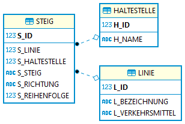

# Inkrementelles Laden mit SQL*Loader

> **Hinweis:** Sie benötigen einen gestarteten Docker Container mit Oracle 19 bzw. 21. 
> Die Anleitung zur Installation befindet sich auf https://github.com/schletz/Dbi2Sem/tree/master/01_OracleVM/03_Docker.

Das *docker run* Kommando aus der Anleitung ist

```
docker run -d -p 1521:1521 -e ORACLE_PASSWORD=oracle -v C:/Temp/oracle-home:/host --name oracle21c gvenzl/oracle-xe:21-full
```

Voraussetzung für diesen Punkt ist, dass *C:\Temp\oracle-home* im Docker Container (Oracle 21) sichtbar ist.
Öffnen Sie daher das Terminal *des Oracle Containers* und geben Sie die folgenden Befehle ein:

```
cd /host
echo "Hello from Oracle" > test.txt
```

Sie sehen nun in *C:\Temp\oracle-home* die Datei *test.txt*.

## Intro

Auf
[data.gv.at](https://www.data.gv.at/katalog/dataset/stadt-wien_wienerlinienechtzeitdaten)
stehen die Daten der Wiener Linien (Haltestellen, Linien, Steige) als
CSV Datei zur Verfügung. Die Dateien sind UTF-8 codiert, haben als
Trennzeichen ein Semikolon (;) und Strings sind unter Anführungszeichen
gesetzt. Zeilenumbruch ist der Windows Standard CR+LF. Sie können von
folgenden Adressen bezogen werden:

- *csv-linien*: https://data.wien.gv.at/csv/wienerlinien-ogd-linien.csv
- *csv-haltestellen*: https://data.wien.gv.at/csv/wienerlinien-ogd-haltestellen.csv
- *csv-steige*: https://data.wien.gv.at/csv/wienerlinien-ogd-steige.csv

### Die CSV Datei der Linien

Jede Linie hat in der Datei *wienerlinien-ogd-linien.csv* in der Spalte
*LINIEN_ID* eine ID, die als Fremdschlüssel in der Datei
*wienerlinien-ogd-steige.csv* in der Spalte *FK_LINIEN_ID* verwendet
wird. Daneben gibt es bei den Steigen noch die Spalte
*FK_HALTESTELLEN_ID*, die auf die entsprechende Haltestelle in der
Datei *wienerlinien-ogd-haltestellen.csv* verweist. Anbei die ersten 5
Zeilen der Liniendatei, nicht benötigte Spalten werden nicht angezeigt:

| LINIEN_ID  | BEZEICHNUNG | VERKEHRSMITTEL |
| ---------: | :---------- | :------------- |
|  215096838 | 99A         | ptBusCity      |
|  214433895 | 57A         | ptBusCity      |
|  214432881 | 10          | ptBusCity      |
|  218957255 | 79A         | ptBusCity      |
|  214433967 | N35         | ptBusNight     |

### Die CSV Datei der Steige

Wollen wir nun alle Haltestellen der Linie 12A (ID 214433815) wissen,
müssen wir die ID in der Datei Steige suchen und erfahren dort, dass
folgende Datensätze zugeordnet sind. Es wird bei der Reihenfolge
zwischen Hin (Richtung H) und Retour (Richtung R) unterschieden. Anbei
die ersten 5 Steige der Linie 12A, nicht benötigte Spalten werden nicht
angezeigt:

| STEIG_ID  | FK_LINIEN_ID   | FK_HALTESTELLEN_ID   | RICHTUNG | REIHENFOLGE | STEIG |
| --------: | -------------: | -------------------: | :------- | ----------: | :---- |
| 231475367 |      214433815 |            214461699 | H        |           1 | 48A-R |
| 231475368 |      214433815 |            214461699 | H        |           2 | 10A-H |
| 231475369 |      214433815 |            214460117 | H        |           3 | 10A-H |
| 231475370 |      214433815 |            214461744 | H        |           4 | 12A-H |
| 231475371 |      214433815 |            214460711 | H        |           5 | 12A-H |
| 231475428 |      214433815 |            214460372 | R        |           1 | 12A   |
| 231475429 |      214433815 |            214461309 | R        |           2 | 12A   |
| 231475430 |      214433815 |            214460695 | R        |           3 | 12A   |
| 231475431 |      214433815 |            214461152 | R        |           4 | 12A   |
| 231475432 |      214433815 |            214461310 | R        |           5 | 12A-R |

### Die CSV Datei der Haltestellen

Die Verknüpfung mit der Haltestellendatei gibt uns nun die Namen der
Haltestellen zurück. Folgendes Beispiel liefert die ersten 5
Haltestellen der Linie 12A in der Richtung “H” in der korrekten
Reihenfolge:

| HALTESTELLEN_ID  | NAME                    | REIHENFOLGE | STEIG |
| ---------------: | :---------------------- | ----------: | :---- |
|        214461699 | Schmelz, Gablenzgasse   |           1 | 48A-R |
|        214461699 | Schmelz, Gablenzgasse   |           2 | 10A-H |
|        214460117 | Auf der Schmelz         |           3 | 10A-H |
|        214461744 | Schanzstraße/Akkonplatz |           4 | 12A-H |
|        214460711 | Johnstraße              |           5 | 12A-H |

## 1. Schritt: Laden der Dateien

Mit *wget* können Sie in Linux Daten direkt auf Ihr System laden. Führen Sie die folgenden Befehle
im Verzeichnis */host* aus, um ein Verzeichnis *wienerlinien* dort anzulegen und die Daten vom Server
zu laden. Bestätigen Sie das letzte Statement mit Enter, damit es ebenfalls ausgeführt wird.

**Oracle 19/21 Container**
```bash
cd /host
rm -rf wienerlinien
mkdir wienerlinien
cd wienerlinien
curl https://data.wien.gv.at/csv/wienerlinien-ogd-linien.csv --output wienerlinien-ogd-linien.csv
curl https://data.wien.gv.at/csv/wienerlinien-ogd-haltestellen.csv --output wienerlinien-ogd-haltestellen.csv
curl https://data.wien.gv.at/csv/wienerlinien-ogd-steige.csv --output wienerlinien-ogd-steige.csv
ls -alh
```

Die Ausgabe des letzten Befehles (*ls*) sollte nun so lauten:

```text
total 892K
drwxr-xr-x.  2 oracle oinstall 4.0K Mar  6 03:06 .
drwxr-xr-x. 41 oracle oinstall 4.0K Mar  6 03:06 ..
-rw-r--r--.  1 oracle oinstall 216K Jan 13 04:19 wienerlinien-ogd-haltestellen.csv
-rw-r--r--.  1 oracle oinstall 7.0K Jan 13 04:19 wienerlinien-ogd-linien.csv
-rw-r--r--.  1 oracle oinstall 653K Jan 13 04:19 wienerlinien-ogd-steige.csv
```

## 2. Schritt: Erstellen der Datenbank

Für eine Applikation sollen die Daten periodisch (z. B. 1x in der Nacht)
in eine lokale Oracle Datenbank geladen werden. Für diese wird ein User *Wienerlinien* in Oracle
angelegt. Dafür führen Sie die folgenden Befehle durch Kopieren und Einfügen aus, um den Benutzer anzulegen.
Bestätigen Sie das Statement mit Enter, damit es ebenfalls ausgeführt wird.

**Oracle 19/21**
```bash
sqlplus System/oracle@//localhost/XEPDB1 <<< "
    DROP USER Wienerlinien CASCADE;
    CREATE USER Wienerlinien IDENTIFIED BY oracle;
    GRANT CONNECT, RESOURCE, CREATE VIEW TO Wienerlinien;
    GRANT UNLIMITED TABLESPACE TO Wienerlinien;"
```

Um die Datenbank anzulegen kopieren Sie die folgenden SQL Anweisungen in die Konsole. Bestätigen
Sie das Statement mit Enter, damit es ebenfalls ausgeführt wird.

**Oracle 19/21**
```bash
sqlplus Wienerlinien/oracle@//localhost/XEPDB1 <<< "
    DROP TABLE Steig CASCADE CONSTRAINTS;
    DROP TABLE Haltestelle CASCADE CONSTRAINTS;
    DROP TABLE Linie CASCADE CONSTRAINTS;
    CREATE TABLE Linie (
        L_ID             INTEGER PRIMARY KEY,
        L_Bezeichnung    VARCHAR2(200) NOT NULL,
        L_Verkehrsmittel VARCHAR2(200) NOT NULL
    );
    CREATE TABLE Haltestelle (
        H_ID   INTEGER PRIMARY KEY,
        H_Name VARCHAR2(200) NOT NULL
    );
    CREATE TABLE Steig (
        S_ID          INTEGER PRIMARY KEY,
        S_Linie       INTEGER NOT NULL,
        S_Haltestelle INTEGER NOT NULL,
        S_Steig       VARCHAR2(10),
        S_Richtung    CHAR(1) NOT NULL,
        S_Reihenfolge INTEGER NOT NULL,
        FOREIGN KEY (S_Linie) REFERENCES Linie(L_ID),
        FOREIGN KEY (S_Haltestelle) REFERENCES Haltestelle(H_ID)
    );
    SELECT COUNT(*) FROM Linie;
    SELECT COUNT(*) FROM Haltestelle;
    SELECT COUNT(*) FROM Steig;"
```

Grafisch dargestellt sieht das Schema so aus:



## 3. Schritt: Erstbeladung der Datenbank

### Beladen mit Oracle SQL Loader

Schreiben Sie ein Controlfile für die Dateien
*wienerlinien-ogd-linien.csv*, *wienerlinien-ogd-haltestellen.csv* und
*wienerlinien-ogd-steige.csv*, die diesen Datenbestand in die Tabellen
Linie, Haltestelle und Steig lädt. Achten Sie auf die Reihenfolge beim
Ausführen der Befehle, durch die Fremdschlüsselbeziehungen muss zuerst
Linie und Haltestelle, danach erst die Tabelle Steig beladen werden.

Fügen Sie nun die Importe zu einem Shellscript mit dem Namen
*importLinien.sh* zusammen. Vergessen Sie nicht, mit *chmod* die Ausführungsrechte zu setzen.

**Oracle 19/21 Container**
```bash
sqlldr userid=Wienerlinien/oracle@//localhost/XEPDB1 control=linie.ctl
sqlldr userid=Wienerlinien/oracle@//localhost/XEPDB1 control=haltestelle.ctl
sqlldr userid=Wienerlinien/oracle@//localhost/XEPDB1 control=steig.ctl

```

## 4. Schritt: Aktualisieren der Daten bei einem neuen Beladen

Da Sie nicht direkt die Haupttabellen beladen können (referentielle
Integrität), erstellen Sie 3 Tabellen: Tabelle *LinieStage*,
*HaltestelleStage* und *SteigStage* in der Oracle Datenbank. Diese
Tabellen werden immer von den entsprechenden Textdateien mit *REPLACE*
beladen. Der Aufbau der Tabellen ist natürlich ident mit den vorher definierten Tabellen, deswegen
können Sie das *CREATE TABLE* Statement von oben übernehmen.

Starten Sie nun Ihr Shellscript mit *./importLinien.sh*. Es sollte nun die Stage Tabellen
beladen. Prüfen Sie das, indem Sie mit *sqlplus Wienerlinien/oracle* in sqlplus einsteigen und
die Tabellen selektieren.

## 5. Schritt: Prozedur für den Datenimport

Nun kann es vorkommen, dass die Linienführung geändert wird (siehe 14A,
der verlegt wurde). Da Sie immer die Originaldateien aus dem Netz
laden, müssen Sie bei einem vorhandenen Datenbestand folgendes beachten:

1. Linien, die neu hinzugekommen sind, werden eingefügt.
2. Haltestellen, die neu hinzugekommen sind, werden eingefügt.
3. Die Tabelle Steig wird geleert und neu beladen. Das ist möglich, da
   es keine Fremdschlüsselbeziehung auf die Tabelle Steig gibt.
4. Linien und Haltestellen, die nicht mehr vorkommen, müssen gelöscht
   werden.

Überlegen Sie sich, ob diese Reihenfolge verpflichtend ist oder ob auch
eine andere Reihenfolge möglich ist.

Damit Sie die Daten von den Stage Tabellen übertragen können, muss Ihre Prozedur die oben
beschriebenen 4 Fälle in INSERT bzw. DELETE Anweisungen umsetzen:

Überlegen Sie sich die notwendigen SQL Anweisungen. Sie können über den Primärschlüssel der jeweiligen
Tabelle (*H_ID*, *S_ID* und *L_ID*) immer feststellen, ob der Datensatz schon in Ihrer Tabelle
vorhanden ist. Testen Sie diese vorher in SQL Developer oder einem anderen SQL Editor unter dem User
*Wienerlinien*.

Nun schreiben Sie diese Anweisungen in einer PL/SQL Prozedur zusammen. Diese überträgt die Daten
aus den Stage Tabellen und verletzen zu keinem Zeitpunkt die referentielle Integrität. Leeren Sie
am Ende wieder die Stage Tabellen, damit ein neuer Import einen definierten Zustand vorfindet.

Der Rumpf Ihrer Prozedur soll so aussehen:

```sql
CREATE OR REPLACE PROCEDURE import_wienerlinien AS
BEGIN
    -- Die nachfolgenden Anweisungen sind nur zur Demonstration. Ersetzen Sie sie durch Ihre
    -- SQL Anweisungen.
    DELETE FROM LINIE;
    INSERT INTO LINIE VALUES (1, 'Testlinie', 'Bus');
END;

```

Wenn die Prozedur angelegt wurde, können Sie Ihr Skellscript *importLinien.sh* um den Aufruf der
Prozedur *import_wienerlinien* ergänzen und ausführen:

**Oracle 19/21**
```bash
sqlldr userid=Wienerlinien/oracle@//localhost/XEPDB1 control=linie.ctl
sqlldr userid=Wienerlinien/oracle@//localhost/XEPDB1 control=haltestelle.ctl
sqlldr userid=Wienerlinien/oracle@//localhost/XEPDB1 control=steig.ctl
sqlplus Wienerlinien/oracle@//localhost/XEPDB1 <<< "
    CALL import_wienerlinien();
    SELECT COUNT(*) FROM LINIE;"
```

## Testen, Testen, Testen

Führen Sie mehrere Tests durch. Da das Ändern der Textdateien mühsam
ist, können Sie in Ihrer Datenbank

- Eine Linie samt ihren Steigen löschen und danach das Importscript
  starten.
- Alle Steige löschen und danach das Importscript starten.
- Eine neue Linie einfügen und dieser z. B. alle Steige der Linie 14A
  geben (INSERT mit SELECT) und danach Importscript starten.

## Bewertung

Jede erfolgreich bewältigte Aufgabe bringt 1 Punkt.

- Das Controlfile für die Linien ist korrekt.
- Das Controlfile für die Haltestellen ist korrekt.
- Das Controlfile für die Steige ist korrekt.
- Die Tabelle LinieStage wurde erstellt.
- Die Tabelle HaltestelleStage wurde erstellt.
- Die Tabelle SteigStage wurde erstellt.
- Das Skript importLinien.sh befüllt alle Stage Tabellen.
- Die Prozedur import_wienerlinien wurde angelegt.
- Die Prozedur hat folgende Features:
  1. Linien, die neu hinzugekommen sind, werden eingefügt.
  2. Haltestellen, die neu hinzugekommen sind, werden eingefügt.
  3. Die Tabelle Steig wird geleert und neu beladen. Das ist möglich, da
     es keine Fremdschlüsselbeziehung auf die Tabelle Steig gibt.
  4. Linien und Haltestellen, die nicht mehr vorkommen, müssen gelöscht
     werden.
- Das Skript importLinien.sh ruft die Prozedur auf und importiert die Daten.
  
In Summe sind 13 Punkte zu erreichen. 