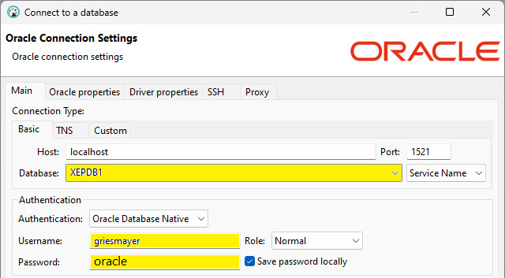

# Docker Materialien der DWH Übungen auf griesmayer.com

Hier werden adaptierte Datenfiles für die Übungen auf **http://griesmayer.com/?menu=Data%20Warehouse** bereitgestellt.

## Arbeiten mit Docker

### Installation des Docker Images

Für diese Übungen brauchst du das Docker Image für Oracle 21 XE.
Auf [Docker Container für Oracle 21 XE](https://github.com/schletz/Dbi2Sem/blob/master/01_OracleVM/03_Docker/README.md) im Kurs *Dbi2Sem* wird die Installation beschrieben.

Der verwendete *docker run* Befehl lautet

**für Windows**
```text
docker run -d -p 1521:1521 -e ORACLE_PASSWORD=oracle -v C:/Temp/oracle-home:/host --name oracle21c gvenzl/oracle-xe:21-full
```

**für macOS und Linux**
```bash
mkdir $HOME/oracle-home
chmod 777 $HOME/oracle-home
docker run -d -p 1521:1521 -e ORACLE_PASSWORD=oracle -v $HOME/oracle-home:/host --name oracle21c gvenzl/oracle-xe:21-full
```

Beachte die Anleitung für [Apple M1 und M2 Geräte](https://github.com/schletz/Dbi2Sem/blob/master/01_OracleVM/03_Docker/README.md#macos-m1-m2-ger%C3%A4te) in der Anleitung.

### Datenaustausch mit dem Host

Im *docker run* Befehl wird der Volume Parameter *-v C:/Temp/oracle-home:/host* bzw. *-v &dollar;HOME/oracle-home:/host* verwendet.
Er bewirkt, dass das Verzeichnis */host* **im Container** in das Verzeichnis *C:/Temp/oracle-home* (Windows) bzw. *&dollar;HOME/oracle-home* (macOS) geleitet wird.
Lege daher Dateien, die in Docker gelesen oder ausgeführt werden sollen, hier ab.

### Anpassen des Prompts in der Shell des Containers

Öffne unter Windows oder macOS die Konsole und gib den folgenden Befehl ein.
Er setzt die Bashkonfiguration, sodass das Working Directory als Prompt angezeigt wird.

```
docker exec -it -u root oracle21c sh -c "echo \"PS1='(oracle21c) \w\$ '\" > ~/.bashrc"
```

### Anlegen eines Testusers im Oracle Container

Öffne mit folgendem Befehl in der Konsole von Windows oder macOS eine Shell des Containers:

```
docker exec -it -u root oracle21c bash
```

Füge danach in der Shell des Containers den folgenden Befehl ein.
Er legt einen User *test* mit dem Passwort *oracle* an.

```
sqlplus system/oracle@//localhost/XEPDB1 <<< "
    DROP USER test CASCADE;
    CREATE USER test IDENTIFIED BY oracle;
    GRANT CONNECT, RESOURCE, CREATE VIEW TO test;
    GRANT UNLIMITED TABLESPACE TO test;
"
```

Achte darauf, dass der Befehl erfolgreich abgeschlossen wurde.
Es muss *Grant succeded* in der Konsole erscheinen.
Nun kannst du dich in DBeaver mit den folgenden Daten zur Oracle Datenbank verbinden:

- **Service Name:** XEPDB1
- **User:** test
- **Passwort:** oracle


## Übung 02_CreateTable

> **Link:** http://griesmayer.com/?menu=Data%20Warehouse&semester=Semester_7&topic=02_CreateTable  
> **Materialien:** [Download der Codedatei](Code_CreateTable_D.zip)

Entpacke den Inhalt der Datei in das Verzeichnis *C:/Temp/oracle-home* (Windows) bzw. *&dollar;HOME/oracle-home* (macOS).
Die Verzeichnisstruktur muss so aussehen:

```
📁 C:/Temp/oracle-home bzw. $HOME/oracle-home
    └──📂 Code_CreateTable_D
        └──📂 src
               └── griesmayer_sales.sh
```

1. Öffne den Ordner *C:/Temp/oracle-home* bzw. *&dollar;HOME/oracle-home* in Visual Studio Code.
2. Öffne das Terminal in VS Code. Verwende dabei das Terminal *cmd* oder *bash* (nicht Powershell!)
3. Rufe mit `docker exec -it -u root oracle21c bash` die Shell des Oracle Containers auf.
4. Gehe mit `cd /host/Code_CreateTable_D/src` in das *src* Verzeichnis.
5. Nur macOS: Setze mit `chmod a+x griesmayer_sales.sh` die Ausführungsrechte.
6. Führe mit `./griesmayer_sales.sh` das Skript aus.

Am Ende sollte *Call completed* erscheinen. Nun kannst du dich in DBeaver mit folgenden Daten zur erstellten Datenbank verbinden:

- **Service Name:** XEPDB1
- **User:** griesmayer
- **Passwort:** oracle

Unter *Schemas* und *Sales* siehst du die angelegten Tabellen.

|  |  |
| ----------------------------- | ---------------------------- |
| VS Code Ansicht               | DBeaver Connection           |


## Übung 03_Load1File

> **Link:** http://griesmayer.com/?menu=Data%20Warehouse&semester=Semester_7&topic=03_Load1File  
> **Materialien:** [Download der Codedatei](Code_Load1File_D.zip)

Entpacke den Inhalt der Datei in das Verzeichnis *C:/Temp/oracle-home* (Windows) bzw. *&dollar;HOME/oracle-home* (macOS).
Die Verzeichnisstruktur muss so aussehen:

```
📁 C:/Temp/oracle-home bzw. $HOME/oracle-home
    └──📂 Code_Load1File_D
        └──📂 src
               └── griesmayer_sales.sh
```

1. Öffne den Ordner *C:/Temp/oracle-home* bzw. *&dollar;HOME/oracle-home* in Visual Studio Code.
2. Öffne das Terminal in VS Code. Verwende dabei das Terminal *cmd* oder *bash* (nicht Powershell!)
3. Rufe mit `docker exec -it -u root oracle21c bash` die Shell des Oracle Containers auf.
4. Installiere mit dem Befehl `microdnf -y install dos2unix` das Programm *dos2unix*.
   Es konvertiert Windows Zeilenumbrüche (CR+LF) in Linux Zeilenumbrüche (LF).
4. Gehe mit `cd /host/Code_Load1File_D/src` in das *src* Verzeichnis.
5. Nur macOS: Setze mit `chmod a+x griesmayer_sales.sh` die Ausführungsrechte.
6. Führe mit `./griesmayer_sales.sh` das Skript aus.

Am Ende wurde die CSV Datei in */host/Code_Load1File_D/data/FACT_SALES_GRIESMAYER.csv* in die Tabelle *SALES.FACT_GRIESMAYER_SALES_STAGING* importiert.
Verbinde dich mit DBeaver wie bei der vorigen Übung, um die Tabelle anzusehen.

## Übung 04_LoadMFiles

> **Link:** http://www.griesmayer.com/?menu=Data%20Warehouse&semester=Semester_7&topic=04_LoadMFiles  
> **Materialien:** [Download der Codedatei](Code_LoadMFiles_D.zip)

Entpacke den Inhalt der Datei in das Verzeichnis *C:/Temp/oracle-home* (Windows) bzw. *&dollar;HOME/oracle-home* (macOS).
Die Verzeichnisstruktur muss so aussehen:

```
📁 C:/Temp/oracle-home bzw. $HOME/oracle-home
    └──📂 Code_LoadMFiles_D
        └──📂 src
               └── griesmayer_sales.sh
```

1. Öffne den Ordner *C:/Temp/oracle-home* bzw. *&dollar;HOME/oracle-home* in Visual Studio Code.
2. Öffne das Terminal in VS Code. Verwende dabei das Terminal *cmd* oder *bash* (nicht Powershell!)
3. Rufe mit `docker exec -it -u root oracle21c bash` die Shell des Oracle Containers auf.
4. Installiere mit dem Befehl `microdnf -y install dos2unix` das Programm *dos2unix*.
   Es konvertiert Windows Zeilenumbrüche (CR+LF) in Linux Zeilenumbrüche (LF).
4. Gehe mit `cd /host/Code_LoadMFiles_D/src` in das *src* Verzeichnis.
5. Nur macOS: Setze mit `chmod a+x griesmayer_sales.sh` die Ausführungsrechte.
6. Führe mit `./griesmayer_sales.sh` das Skript aus.

Am Ende wurden die CSV Dateien in */host/Code_LoadMFiles_D/data* in die Tabelle *SALES.FACT_GRIESMAYER_SALES_STAGING* importiert.
Verbinde dich mit DBeaver wie bei der vorigen Übung, um die Tabelle anzusehen.

## Übung 05_LoadCheck

> **Link:** http://www.griesmayer.com/?menu=Data%20Warehouse&semester=Semester_7&topic=05_LoadCheck  
> **Materialien:** [Download der Codedatei](Code_LoadCheck_D.zip)

Entpacke den Inhalt der Datei in das Verzeichnis *C:/Temp/oracle-home* (Windows) bzw. *&dollar;HOME/oracle-home* (macOS).
Die Verzeichnisstruktur muss so aussehen:

```
📁 C:/Temp/oracle-home bzw. $HOME/oracle-home
    └──📂 Code_LoadCheck_D
        └──📂 src
               └── griesmayer_sales.sh
```

1. Öffne den Ordner *C:/Temp/oracle-home* bzw. *&dollar;HOME/oracle-home* in Visual Studio Code.
2. Öffne das Terminal in VS Code. Verwende dabei das Terminal *cmd* oder *bash* (nicht Powershell!)
3. Rufe mit `docker exec -it -u root oracle21c bash` die Shell des Oracle Containers auf.
4. Installiere mit dem Befehl `microdnf -y install dos2unix` das Programm *dos2unix*.
   Es konvertiert Windows Zeilenumbrüche (CR+LF) in Linux Zeilenumbrüche (LF).
5. Gehe mit `cd /host/Code_LoadCheck_D/src` in das *src* Verzeichnis.
6. Nur macOS: Setze mit `chmod a+x griesmayer_sales.sh` die Ausführungsrechte.
7. Führe mit `./griesmayer_sales.sh` das Skript aus.

Am Ende wurden die CSV Dateien in */host/Code_LoadCheck_D/data* in die Tabelle *SALES.FACT_GRIESMAYER_SALES_STAGING* importiert.
Verbinde dich mit DBeaver wie bei der vorigen Übung, um die Tabelle anzusehen.

