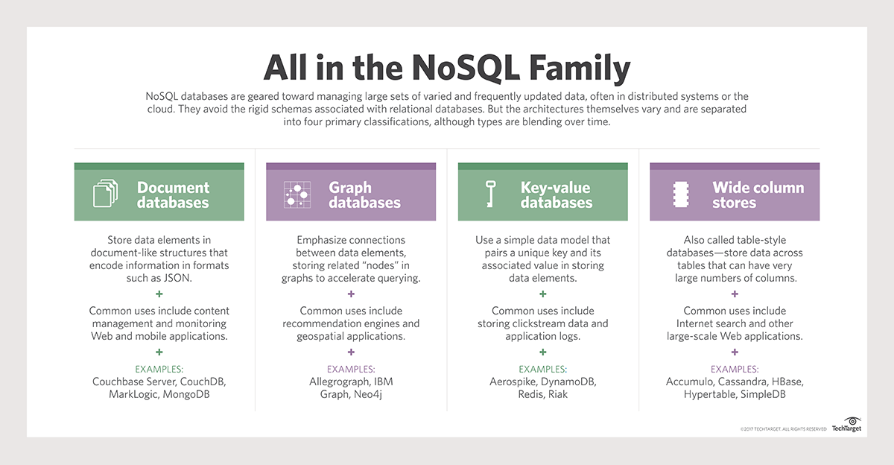

# NoSQL Intro




## 8 Reasons why NoSQL came in 
1. **Schema-Less:** The Biggest reason for NoSQL's sole existence is because of the flexibility provided by NoSQL to model the data as per the application requirements. The RDBMS way of doing is to force our data to fit in a structured way in the form of tables and columns.Most of the NoSQL databases are offering richer form of data storage semantically in which we can store data objects as documents or as key-value pairs or even as graph structures as per the requirements.
1. **Power:** In a NoSQL database, we can add massive volumes of data at a significantly low cost.
1. **Unstructured Data:**In NoSQL databases , we needn't to know how we want to structure the data ahead of its storage. In NoSQL we can store the data first in the Database and structure it later.
1. **Scaling:** In NoSQL databases, the scaling is horizontal as compared to vertical scaling in SQL database whose process is comparatively more time consuming and expensive .
1. **Big Data:** Although SQL is also capable of handling big data but not with as much ease as it is possible with NoSQL databases. It is easier to handle large volumes of structured , semi-structures or unstructured data in NoSQL as compared to SQL databases.
1. **Schema Migration:** As we know that NoSQL is schemaless which makes it easier to deals with stuff like migration.
1. **Write Performance:** Sometimes data is too much to handle on a single storage node and a problem arises i.e data is too big to fit on one node. According to a report Twitter generates almost 8TB of data each day. At almost 100 MB/s it takes more than a day to store 8 TB. Because of this writes need to be distributed over clusters , Key - value access , replication, fault tolerance, Map reduce, consistency issues , etc should be implied. We can also use in-memory systems for faster writes.
1. **Ease:** This changes as per products and vendors but most of the NoSQL vendors are putting lot of efforts on automated operations,ease of access and use , Not much administration is required which leads to lesser costs of operations.

## Modellierung für Firebase
Firebase speichert JSON Daten als **Key - Value Speicher**. Das bedeutet, dass jedes Unterobjekt einen
Key besitzt, mit dem ein Ansprechen möglich ist. Im nachfolgenden Beispiel wurde der Klassenname sowie
der Accountname als eindeutiger Key verwendet. Sehen wir uns ein typisches JSON Dokument an, **wie es 
allerdings nicht sein sollte**:

```js
{
	"Klassen": {
		"3AHIF": {
			"KV": "SZ",
			"Raum": "C3.09",
			"Schueler": {
				"ABC122": {
					"Name": "Nach1",
					"Vorname": "Vor1",
					"Email": "abc122@spengergasse.at"
				},
				"ABC123": {
					"Name": "Nach2",
					"Vorname": "Vor2",
					"Email": "abc123@spengergasse.at"
				}
			}
		},
		"3BHIF": {
			"KV": "SIL",
			"Raum": "C3.10",
			"Schueler": {
				"ABC222": {
					"Name": "Nach1",
					"Vorname": "Vor1",
					"Email": "abc222@spengergasse.at"
				},
				"ABC223": {
					"Name": "Nach2",
					"Vorname": "Vor2",
					"Email": "abc223@spengergasse.at"
				}
			}
		},
		"3CHIF": {
			"KV": "TT",
			"Raum": "C3.11",
			"Schueler": {
				"ABC322": {
					"Name": "Nach1",
					"Vorname": "Vor1",
					"Email": "abc322@spengergasse.at"
				},
				"ABC323": {
					"Name": "Nach2",
					"Vorname": "Vor2",
					"Email": "abc323@spengergasse.at"
				}
			}
		}
	}
}
```

Der Grund, dass wir die Daten nicht so speichern sollten, ist folgender: Angenommen wir möchten eine Übersicht
der Klassen als Liste anzeigen. Dafür brauchen wir nur die Klassenbezeichnung und den KV. Firebase kann
allerdings nur ganze Knoten laden. **Das bedeutet, dass wir für diese Übersichtsliste auch alle Schülerdaten
laden müssen!**

Besser ist folgender Ansatz:
```js
{
	"Klassen": {
		"3AHIF": {
			"KV": "SZ",
			"Raum": "C3.09"
		},
		"3BHIF": {
			"KV": "SIL",
			"Raum": "C3.10"
		},
		"3CHIF": {
			"KV": "TT",
			"Raum": "C3.11"
		}
	},

	"Schueler": {
		"3AHIF": {
			"ABC122": {
				"Name": "Nach1",
				"Vorname": "Vor1",
				"Email": "abc122@spengergasse.at"
			},
			"ABC123": {
				"Name": "Nach2",
				"Vorname": "Vor2",
				"Email": "abc123@spengergasse.at"
			}
		},
		"3BHIF": {
			"ABC222": {
				"Name": "Nach1",
				"Vorname": "Vor1",
				"Email": "abc222@spengergasse.at"
			},
			"ABC223": {
				"Name": "Nach2",
				"Vorname": "Vor2",
				"Email": "abc223@spengergasse.at"
			}
		},
		"3CHIF": {
			"ABC322": {
				"Name": "Nach1",
				"Vorname": "Vor1",
				"Email": "abc322@spengergasse.at"
			},
			"ABC323": {
				"Name": "Nach2",
				"Vorname": "Vor2",
				"Email": "abc323@spengergasse.at"
			}
		}
	}
}
``` 
Bei diesem Ansatz speichern wir die Grundinformationen der Klassen in einem eigenen Dokument *Klassen*.
Die Schüler organisieren wir ebenfalls in Klassen, da unsere Applikation die Schüler klassenweise anzeigen
wird. Wir sehen bereits, **dass wir für eine sinnvolle Modellierung bereits wissen müssen, wie die Applikation
die Daten abfragen wird.**

Weitere Infos gibt es auf [howtofirebase.com](https://howtofirebase.com/firebase-data-modeling-939585ade7f4) 
und auf [firebase.google.com/](https://firebase.google.com/docs/database/web/structure-data) nachzulesen.

