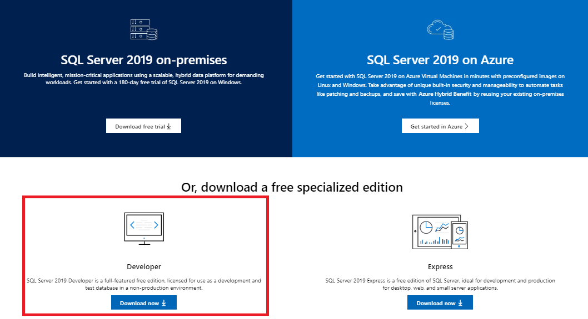
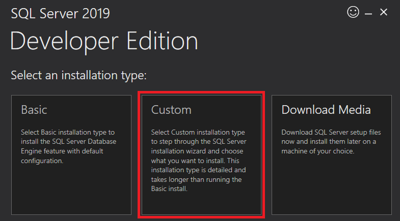
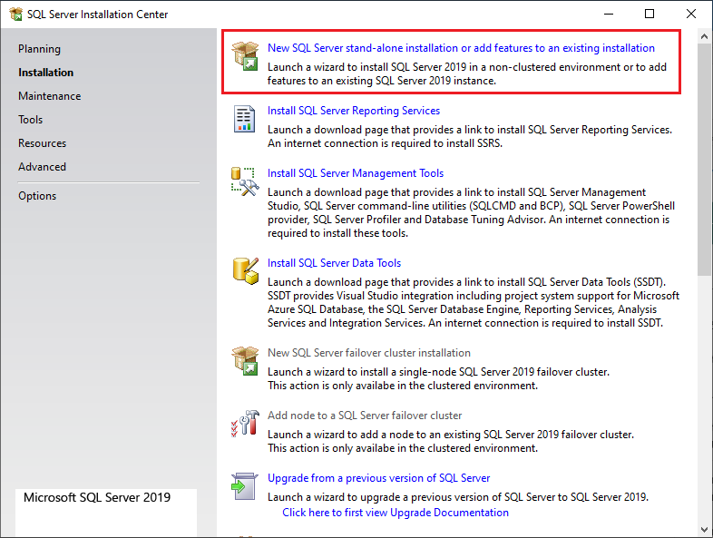
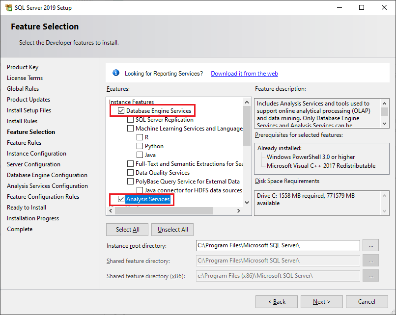
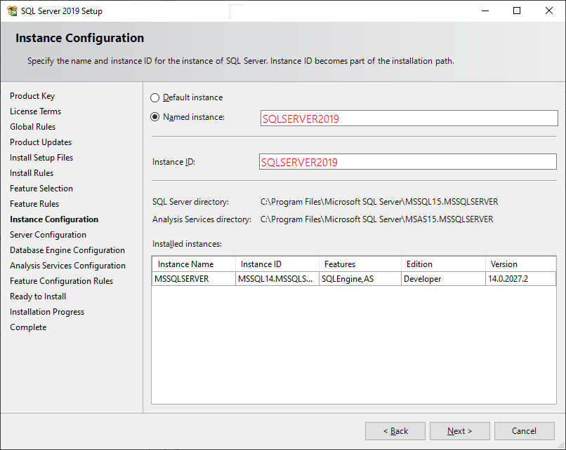
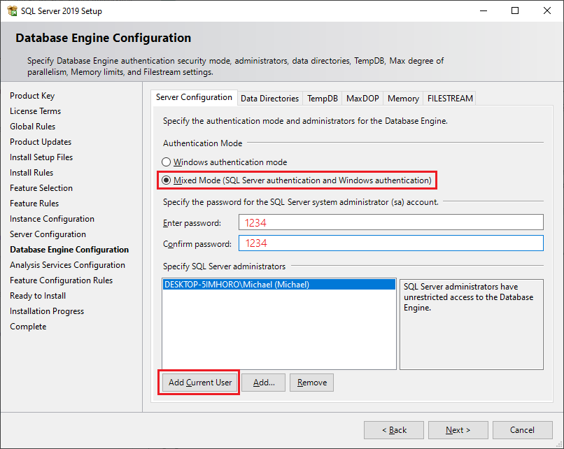
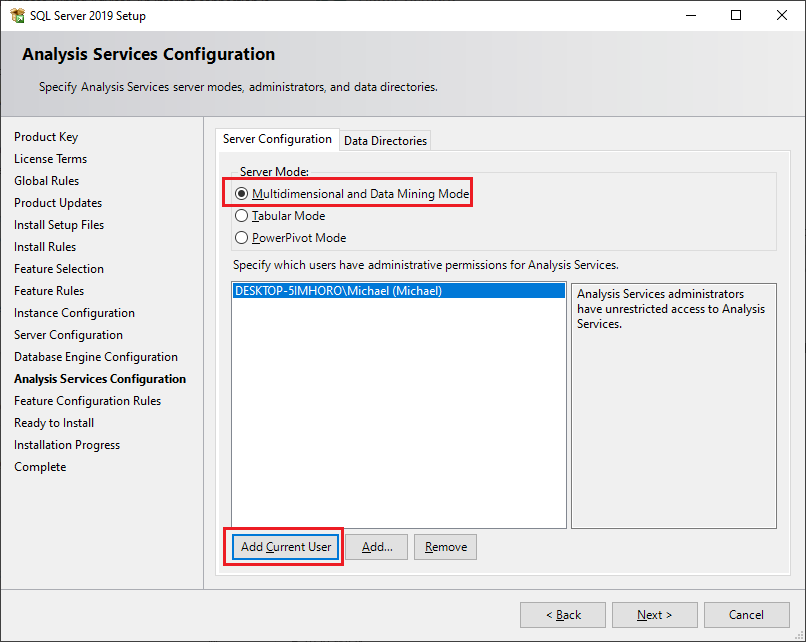
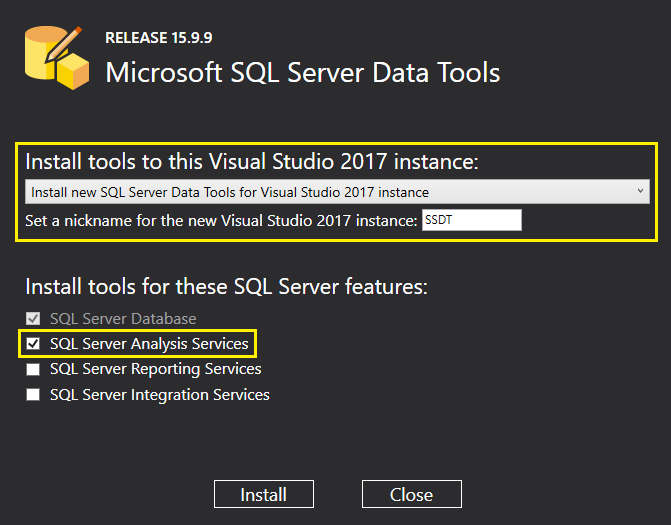
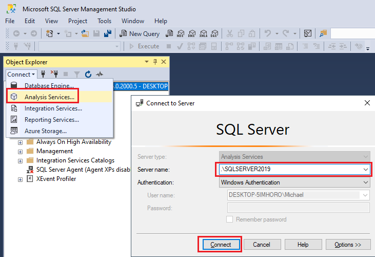

# Installation der SQL Server 2019 Analysis Services

> **Wichtig:** Starten Sie vor der Installation Windows neu. Ausstehende Updates, etc. verhindern
> ein erfolgreiches Setup!

Für den Zugriff auf die Analysis Services von SQL Server benötigen wir eine lokale Installation
von SQL Server 2019. Sie können die Installationsdatei der Developer Edition von der
[SQL Server Downloadseite](https://www.microsoft.com/en-us/sql-server/sql-server-downloads)
beziehen.

## Installationsdialoge

Nach dem Starten des Installers wählen Sie *Custom*. Danach werden Sie nach dem Ort gefragt, wo die
Installationsdateien kopiert werden sollen. Dieser kann beliebig sein.

Nach dem Download startet das Setup und Sie können eine neue SQL Server Instanz installieren:

Die weiteren Dialoge können Sie einfach bestätigen, die Dialoge wo Einstellungen gemacht werden
müssen sind nachfolgend erklärt.

Bei den Features wählen Sie die Database Engine und die Analysis Services.

Als Instanzname wählen Sie *SQLSERVER2019*, damit jeder den gleichen Namen hat.

Für die Authentifizierung wählen Sie *Mixed Mode*. Dadurch können Sie mit Ihrem aktuellen Windows
Benutzer und mit dem User *sa* einsteigen. Da wir den SQL Server nicht nach außen freigeben, genügt
ein schwaches Kennwort (hier *1234*)

Für die Analysis Services aktivieren wir den *Multidimensional and Data Mining Mode*. Er erlaubt
das Erstellen von CUBEs.

## Installation der Visual Studio Extension

Derzeit (16.3.2022) gibt es die Extension
[Microsoft Analysis Services Projects](https://marketplace.visualstudio.com/items?itemName=ProBITools.MicrosoftAnalysisServicesModelingProjects)
nicht für Visual Studio 2022. 

Auf
https://docs.microsoft.com/en-us/sql/ssdt/download-sql-server-data-tools-ssdt?view=sql-server-ver15#ssdt-for-vs-2017-standalone-installer
steht eine standalone Version zur Verfügung. Installieren Sie mit Hilfe dieser Version die Analysis Services:

Nach der Eingabe von *SSDT* im Startmenü können Sie die Standallone Version von Visual Studio 2017
öffnen und mit *File* - *New* - *Project* ein Analysis Services Projekt anlegen.

## Installation von SQL Server Management Studio

Um Ihre SQL Server Installation zu testen, laden Sie sich das SQL Server Management Studio von
der [Microsoft Downloadseite](https://docs.microsoft.com/en-us/sql/ssms/download-sql-server-management-studio-ssms?view=sql-server-ver15).

Starten Sie nun das Management Studio, indem Sie *SSMS* im Startmenü eingeben. Dnach können Sie sich
mit dem Server *.\SQLSERVER2019* (oder dem gewählten Instanznamen) verbinden. Danach wählen Sie
*Connect - Analysis Servives* und verbinden sich mit Ihrer SQL Server Analysis Services Instanz,
die ebenfalls unter *.\SQLSERVER2019* erreichbar ist.

