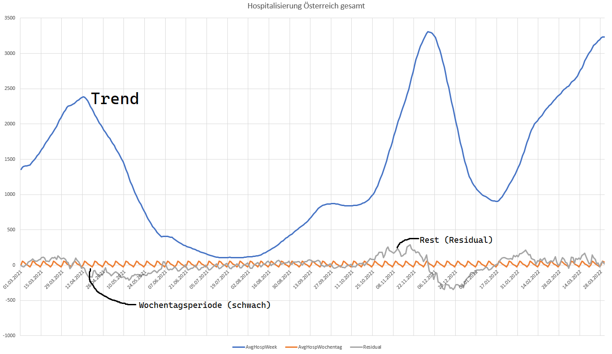

# Generierung der Musterdatenbank, Zeitreihenanalyse

## SQL Server als Docker Image

Für die Übung brauchen Sie das Docker Image von SQL Server.
Es läuft auch auf ARM Architekturen, deswegen ist eine Emulation wie Colima unter Apple M1 oder M2 nicht nötig.
Prüfen Sie vorher, ob der Port 1433 nicht schon durch einen lokalen Server belegt ist.
Der nachfolgende Befehl wird **in der Git Bash** oder im Terminal von macOS ausgeführt.

```
netstat -a -n  | grep :1433
```

Liefert er nichts zurück, dann ist der Port 1433 frei.
Ansonsten beenden Sie lokale SQL Server Installationen über *Dienste*.
Der nachfolgende Befehl legt einen Container mit dem Namen *sqlserver2019* an:

**für Windows**
```
docker run -d -p 1433:1433  --name sqlserver2019 -v C:\Temp\sql-home:/host -e "ACCEPT_EULA=Y" -e "SA_PASSWORD=SqlServer2019" mcr.microsoft.com/azure-sql-edge
```

**für macOS und Linux**
```bash
mkdir $HOME/sql-home
chmod 777 $HOME/sql-home
docker run -d -p 1433:1433  --name sqlserver2019 -v $HOME/sql-home:/host -e "ACCEPT_EULA=Y" -e "SA_PASSWORD=SqlServer2019" mcr.microsoft.com/azure-sql-edge
```

### Verbinden mit DBeaver oder dem SQL Server Management Studio

Für den Zugriff auf SQL Server können alle gängigen SQL Editoren wie DBeaver, ... verwendet werden.
Speziell für SQL Server gibt es das Programm *[SQL Server Management Studio](https://learn.microsoft.com/de-de/sql/ssms/download-sql-server-management-studio-ssms?view=sql-server-ver16)*.
Es ermöglicht spezifischere Konfigurationen wie Anlegen von Usern in der GUI, Management von Datenbanken, ...
Sie können sich zum oben angelegten Docker Container mit folgenden Daten verbinden:

- **Server:** localhost
- **Datenbank:** master
- **Username:** sa
- **Passwort:** SqlServer2019

## Programm zum Generieren der Musterdatenbank

Starten Sie das .NET 6 Programm im Ordner DataGenerator mit dem folgenden Befehl im Ordner *42_DatabaseGenerator/DataGenerator*:

```text
dotnet restore --no-cache && dotnet run -c Release 
```

Danach werden Serveradresse, Datenbankname, ... abgefragt. In den eckigen Klammern sind die
Standardwerte angegeben, die mit dem vorher angegebenen Docker Container funktionieren.

Das Programm erstellt die SQL Server Datenbank und fügt 10000 Verkäufe ein. Für eine genauere
Analyse ist aber ein Datenbestand von 1 000 000 Verkäufen nötig. Das Programm schreibt diese Daten
in eine Tab getrennte Textdatei.

```text
DATENGENERATOR FÜR VERKÄUFE
Erstelle die Datenbank...
Füge die Daten ein (10000 Verkäufe)...
10000 Verkäufe in 3.0 s eingefügt.
1000000 Verkäufe in die Datei C:\Temp\verkauf_unicode.tsv geschrieben.
Um alle Verkäufe in die Tabelle Verkauf zu laden, kopiere sie in ein Verzeichnis auf das der SQL Server Container Zugriff hat.
Führe folgenden Befehl im SQL Editor aus. /host ist das Volume, wo die tsv Datei liegt:

USE Fahrkarten;
TRUNCATE TABLE Verkauf;
BULK INSERT Verkauf
FROM '/host/verkauf_unicode.tsv' WITH (
        CODEPAGE  = 'RAW',
        FIRSTROW = 1,
        FIELDTERMINATOR = '\t'
);
SELECT COUNT(*) FROM Verkauf v;
```

## Durchführen einer einfachen Auswertung: Zerlegung der Zeitreihe in Komponenten

Nach dem Erstellen der Datenbank muss noch die Timetable Tabelle erstellt und der Inhalt geladen werden.
Kopieren Sie vorher die Datei [timetable_unicode.tsv](timetable_unicode.tsv) in das Verzeichnis *C:\Temp\sql-home* (oder das Verzeichnis, auf das der SQL Server Container Zugriff hat).
Führen Sie dann den folgenden SQL Dump aus:

```sql
CREATE TABLE Timetable (    
    Datum        DATE PRIMARY KEY,
    Datum2000    DATE NOT NULL,
    Jahr         INTEGER NOT NULL,
    Monat        INTEGER NOT NULL,
    Tag          INTEGER NOT NULL,
    WochentagNr  INTEGER NOT NULL,
    WochentagStr CHAR(2) NOT NULL,
    Feiertag     VARCHAR(32) NOT NULL,
    WerktagMoFr  INTEGER NOT NULL,
    WerktagMoSa  INTEGER NOT NULL
);    
GO

BULK INSERT Timetable    
FROM '/host/timetable_unicode.tsv' WITH (    
    CODEPAGE  = 'RAW',
    FIRSTROW = 2,
    FIELDTERMINATOR = '\t'
);    
GO

TRUNCATE TABLE Verkauf;
BULK INSERT Verkauf
FROM '/host/verkauf_unicode.tsv' WITH (
    CODEPAGE  = 'RAW',
    FIRSTROW = 1,
    FIELDTERMINATOR = '\t'
);
GO

CREATE VIEW vUmsatzstatistik AS
SELECT 
t.Datum,
t.WochentagStr,
v.VerkaufId, 
k.KartenartId,
DATEPART(hour, v.Datum) AS Stunde,
v.Menge, 
s.StationId,
v.Menge * k.Preis AS Umsatz
FROM Timetable t LEFT JOIN Verkauf v ON (t.Datum = CAST(v.Datum AS DATE))
                 LEFT JOIN Kartenart k ON (v.KartenartId = k.KartenartId)
                 LEFT JOIN Station s ON (v.StationId = s.StationId)
WHERE t.Datum >= (SELECT MIN(v2.Datum) FROM Verkauf v2) AND 
      t.Datum <= (SELECT MAX(v2.Datum) FROM Verkauf v2);
GO


CREATE VIEW vStundenumsatz AS
SELECT Datum, WochentagStr, Stunde, SUM(Umsatz) AS Umsatz
FROM vUmsatzstatistik
GROUP BY Datum, WochentagStr, Stunde;
GO

CREATE VIEW vUmsatzanalyse AS
SELECT Datum AS Tag, WochentagStr, Stunde, 
DATEADD(hour, Stunde, CAST(Datum AS DATETIME)) AS Datum,
Umsatz,
AVG(Umsatz) OVER(PARTITION BY WochentagStr, Stunde) AS Stundenmittel,
Umsatz - AVG(Umsatz) OVER(PARTITION BY WochentagStr, Stunde) AS Bias
FROM vStundenumsatz;
GO

SELECT *
FROM vUmsatzanalyse
WHERE Tag < '2019-03-01'
ORDER BY Datum
```

## Übung

**(1)** Laden Sie die Datei [timeline-faelle-bundeslaender_unicode.csv](timeline-faelle-bundeslaender_unicode.csv) in das Verzeichnis *C:\Temp*.
Es sind Daten der COVID Fallzahlen, die auf https://info.gesundheitsministerium.gv.at/data/timeline-faelle-bundeslaender.csv publiziert werden.

**(2)**  Erstellen Sie eine SQL Server Datenbank COVID, indem Sie sich mit DBeaver, ... als User *sa* zum SQL Server verbinden und den folgenden Befehl eingeben:

```sql
CREATE DATABASE Covid
```

**(3)**  Erstellen Sie eine Tabelle für die Rohdaten. Achten Sie darauf, dass Sie sich in der Datenbank *Covid* befinden. Sie können mit *USE Covid* die Datenbank wechseln.

```sql
CREATE TABLE CovidTimeline (
	Datum           DATETIME NOT NULL,
	BundeslandID    INTEGER,
	Name            VARCHAR(255),
	BestaetigteFaelleBundeslaender   INTEGER,
	Todesfaelle          INTEGER,
	Genesen              INTEGER,
	Hospitalisierung     INTEGER,
	Intensivstation      INTEGER,
	Testungen            INTEGER,
	TestungenPCR         INTEGER,
	TestungenAntigen	 INTEGER,
	PRIMARY KEY (Datum, BundeslandId)
);
```

**(4)**  Laden Sie die Textdatei in die Tabelle *CovidTimeline*.

```sql
BULK INSERT CovidTimeline    
FROM '/host/timeline-faelle-bundeslaender_unicode.csv' WITH (    
    CODEPAGE  = 'RAW',
    FIRSTROW = 2,
    FIELDTERMINATOR = ';'
);    
```

**(5)**  Erstellen Sie eine View *vCovidAnalyse*, die die durchschnittlichen Hospitalisierungen
  pro BundeslandId und Wochentag auswertet. Sie können den Wochentag mit *DATEPART*
  aus dem Datum extrahieren.
  Die View soll folgende Spalten beinhalten:
  - Datum (nur die Tageskomponente, verwenden Sie daher *CAST*)
  - BundeslandId
  - Wochentag
  - Durchschn. Hospitalisierung für diesen Wochentag und die BundeslandId (Spaltenname AvgHospitalisierung)
  - Differenz Hospitalisierung für diesen Tag - obiger Durchschnittswert (Spaltenname Residual)
  
Diese View muss genausoviele Zeilen wie die originale Tabelle *CovidTimeline* haben. Da die Daten
lückenlos sind, benötigen Sie die Tabelle *Timetable* nicht.

**(6)**  Laden Sie diese Daten in Microsoft Excel und zeigen Sie die Spalten 
*AvgHospitalisierung* und *Residual* des Bundeslandes 10 (Österreich gesamt) als Diagramm an.
Was können Sie beobachten? Ist die Spalte
Residual ein zufälliges Rauschen oder zeigt sich eine Form? Können Sie den Schätzwert
"Mittelwert pro Bundesland und Wochentag" als Prognosewert verwenden?

**(Für Profis)** Unsere Zerlegung basierte auf dem Modell

```
y(t) = a + Residual
```

wobei a der Mittelwert der Hospitalisierung dieses Bundeslandes an einem Wochentag ist. Das Ergebnis
war allerdings nicht zufriedenstellend. Daher werden wir eine weitere Variable hinzufügen:

```
y(t) = a + b + Residual
```

b soll nun der *Trend*, also die durchschnittliche Hospitalisierung diese Bundeslandes der letzten 7 Tage sein
(7 Tages Mittelwert). Um das zu realisieren, müssen Sie zuerst eine Hilfsabfrage
*HospitalisierungAnalyze* erstellen. Da wir sie nur einmal brauchen, können wir sie mit *WITH*
definieren. Dadurch ist die erzeugte Abfrage nur im nachfolgenden Select verfügbar.

Die Abfrage *HospitalisierungAnalyze* berechnet den gleitenden Mittelwert. Die Differenz zum echten
Wert wird als Spalte *Residual* ausgegeben. Dadurch erreichen wir eine Zerlegung in *y = a + Residual*.

Für den zweiten Parameter mitteln wir die Spalte *Residual* nochmals nach Bundesland und Wochentag.
Die Differenz ist die neue Spalte *Residual*. Unter dem Text ist die Grundstruktur der Abfrage
angegeben.

Die Daten werden also in *y = AvgHospWeek + AvgHospWochentag + Residual* zerlegt. Zeigen Sie die
Daten in einem Exceldiagramm an.

```sql
WITH HospitalisierungAnalyze AS (
	SELECT
		-- ...
		AVG(Hospitalisierung) OVER(PARTITION BY BundeslandId ORDER BY Datum ROWS BETWEEN 6 PRECEDING AND CURRENT ROW) AS AvgHospWeek,
		-- Differenz Hospitalisierung zu oberen Wert AS Residual
		FROM CovidTimeline
) 
SELECT 
- ...
AVG(Residual) OVER(PARTITION BY BundeslandId, Wochentag) AS AvgHospWochentag,
Residual - AVG(Residual) OVER(PARTITION BY BundeslandId, Wochentag) AS Residual
FROM HospitalisierungAnalyze
```

Ändern Sie den Zeitraum des Trends von 7 Tagen (*6 PRECEDING AND CURRENT ROW* in SQL) auf 
2, 14 oder 30 Tage. Was fällt Ihnen im Diagramm auf? Beobachten Sie, wie "glatt" die Trendlinie ist.

Eine Voraussage kann z. B. mit einer Polynominterpolation des Trends (*AvgHospWeek*) und Addieren
der Spalte *AvgHospWochentag* des entsprechenden Wochentages gemacht werden.



Der Graph von *Residual* hat noch einen periodischen Anteil, da die Wochentagsperiode auch vom
Wert der aktuellen Hospitalisierung abhängt (wenn am Freitag z. B. 10% der Personen entlassen werden,
ergibt sich diese Abhängigkeit). Weiterführende Pakete in Python wie auf
https://machinelearningmastery.com/decompose-time-series-data-trend-seasonality
beschrieben berücksichtigen auch diesen Umstand.
