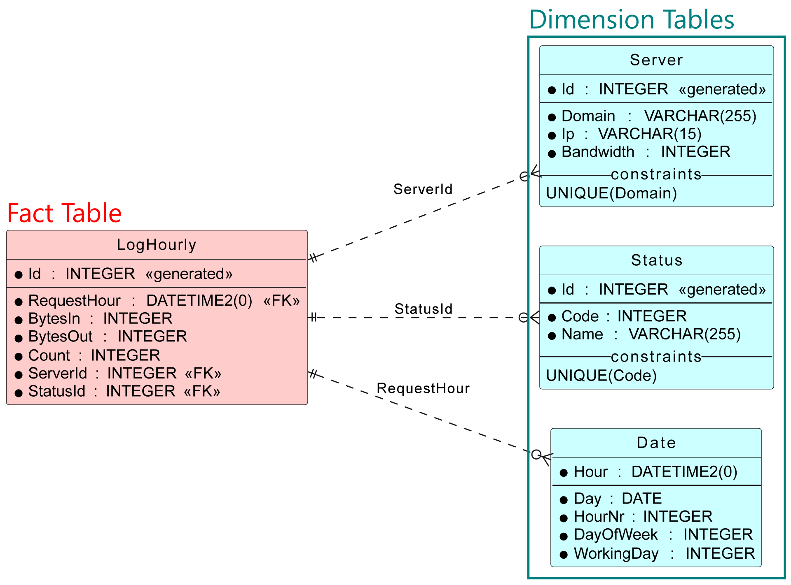
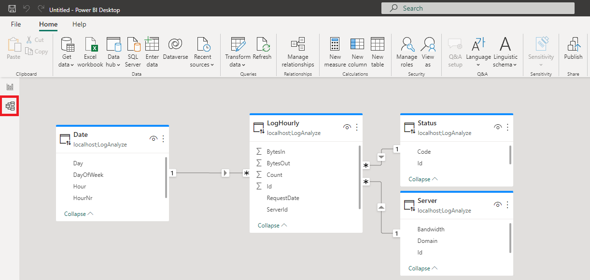

# Das Star Schema

## SQL Server Docker Image

Erstelle, falls in den vorigen Übungen nicht schon geschehen, einen SQL Server Container:

**für Windows**
```
docker run -d -p 1433:1433  --name sqlserver2019 -v C:\Temp\sql-home:/host -e "ACCEPT_EULA=Y" -e "SA_PASSWORD=SqlServer2019" mcr.microsoft.com/azure-sql-edge
```

**für macOS und Linux**
```bash
mkdir $HOME/sql-home
chmod 777 $HOME/sql-home
docker run -d -p 1433:1433  --name sqlserver2019 -v $HOME/sql-home:/host -e "ACCEPT_EULA=Y" -e "SA_PASSWORD=SqlServer2019" mcr.microsoft.com/azure-sql-edge
```

## Intro

Im letzten Beispiel haben wir die Fahrkartenverkäufe ausgewertet.
Das Programm legte hierfür eine kleine SQL Server Datenbank mit folgendem Schema an:


<sup>[PlantUML Source](https://www.plantuml.com/plantuml/uml/fP91QuCm5CVl-HJlQCUKKTR3f4YbpJgfbk6azs1Uqp0R8NqUHhlllZWCTeEnmJm8xv-_FtxwN9n8MEgE3JjeYL1hMpV86jmJK0jMgmE1r1PhqgrXQ4ZJ6xoGw4SuCt3NZPyp2J5asuglUGdpkKA3LX3A9FdiXM4uzBVYYAwwIylbKre6qzbiCfpa3aITx4zBdkO-ROtw4hyphx9nzcZSpSkCoRzrAg5mtM53MesauPbdY_haqXLVPaMQ1m-tzvChhHtQLz7jlPIV_woq4cudFJwjU9KLV1hS-KzKe54uOdvvwyTDaloy9LzmujxuSecYg3sFG8YluTzxdWhno6SBDDBzKXy0)</sup>

Um die Daten sinnvoll auswerten zu können, mussten wir zuerst die Views *vUmsatzstatistik* und *vStundenumsatz* anlegen.
Die View *vStundenumsatz* aggregierte die Daten in der feinsten Zeiteinheit, nämlich in Stunden.
Außerdem wurde der Umsatz mit der Formel *Menge x Preis* berechnet.

```sql
CREATE VIEW vUmsatzstatistik AS
    SELECT 
    t.Datum,
    t.WochentagStr,
    v.VerkaufId, 
    k.KartenartId,
    DATEPART(hour, v.Datum) AS Stunde,
    v.Menge, 
    s.StationId,
    v.Menge * k.Preis AS Umsatz
    FROM Timetable t LEFT JOIN Verkauf v ON (t.Datum = CAST(v.Datum AS DATE))
                    LEFT JOIN Kartenart k ON (v.KartenartId = k.KartenartId)
                    LEFT JOIN Station s ON (v.StationId = s.StationId)
    WHERE t.Datum >= (SELECT MIN(v2.Datum) FROM Verkauf v2) AND 
        t.Datum <= (SELECT MAX(v2.Datum) FROM Verkauf v2);

CREATE VIEW vStundenumsatz AS
    SELECT Datum, WochentagStr, Stunde, SUM(Umsatz) AS Umsatz
    FROM vUmsatzstatistik
    GROUP BY Datum, WochentagStr, Stunde;        
```

Diese View wurde so gestaltet, dass wir den *Gesamtumsatz* aller Verkäufe in Excel leicht darstellen konnten.
Wir haben allerdings durch die Gruppierung die Kartenart und die Station "verloren".
Daher wollen wir uns mit einem allgemeineren Konzept der Auswertung beschäftigen: *dem Star Schema*, auch *Star Model* genannt.

Dafür sehen wir uns die Datei [log_unicode.txt](log_unicode.txt) an.
Sie könnte aus einer Firewall entstanden sein, die verschiedene Serverrequests aufzeichnet.
Ein Sample von 10 Datensätzen sieht so aus:

```
| RequestDate         | ClientIp        | RequestUrl                                    | BytesIn | BytesOut | ServerDomain               | ServerIp       | ServerBandwidth | StatusCode | StatusName |
| ------------------- | --------------- | --------------------------------------------- | ------- | -------- | -------------------------- | -------------- | --------------- | ---------- | ---------- |
| 2021-03-31 10:46:53 | 163.79.105.229  | /parse                                        | 878     | 857624   | e-formular.spengergasse.at | 192.168.51.149 | 1000            | 200        | OK         |
| 2021-04-28 13:43:19 | 12.185.9.145    | /rustic                                       | 248     | 347905   | www.spengergasse.at        | 192.168.51.143 | 1000            | 200        | OK         |
| 2021-07-15 09:49:21 | 62.49.190.48    | /multi-channelled/hdd/fresh                   | 724     | 241077   | www.spengergasse.at        | 192.168.51.143 | 1000            | 200        | OK         |
| 2021-12-08 18:58:54 | 23.130.38.26    | /firewall                                     | 640     | 889202   | e-formular.spengergasse.at | 192.168.51.149 | 1000            | 200        | OK         |
| 2021-12-19 20:53:22 | 183.68.204.218  | /massachusetts/delaware/refined-concrete-ball | 478     | 464906   | www.spengergasse.at        | 192.168.51.143 | 1000            | 200        | OK         |
| 2022-01-07 12:12:02 | 69.16.242.197   | /green/navigating                             | 317     | 679705   | e-formular.spengergasse.at | 192.168.51.149 | 1000            | 200        | OK         |
| 2022-01-09 22:36:50 | 106.94.92.65    | /books-shoes--computers/handmade-rubber-car   | 987     | 174600   | www.spengergasse.at        | 192.168.51.143 | 1000            | 200        | OK         |
| 2022-03-01 08:25:31 | 132.161.248.155 | /awesome-fresh-chicken                        | 679     | 1003588  | e-formular.spengergasse.at | 192.168.51.149 | 1000            | 200        | OK         |
| 2022-04-11 16:59:12 | 252.156.165.245 | /empower/copying/radial                       | 525     | 201916   | www.spengergasse.at        | 192.168.51.143 | 1000            | 200        | OK         |
| 2022-08-23 19:16:00 | 194.215.82.28   | /capacitor/flats                              | 573     | 728072   | www.spengergasse.at        | 192.168.51.143 | 1000            | 200        | OK         |
```

Das Ziel ist eine Auswertung nach verschiedenen Spalten:
- Requests nach der ServerDomain.
- Requests nach dem Statuscode.
- Requests im Zeitverlauf.
- Requests pro ServerDomain im Zeitverlauf.
- Requests pro ServerIp (eine IP hostet mehrere Domains).

Wir sehen, dass es mehrere sinnvolle Möglichkeiten gibt, diese Datei auszuwerten.
Natürlich können wir mit einzelnen Views und *GROUP BY* Operationen diese Auswertungen herstellen.
Das ist allerdings unflexibel, das Ziel ist dass ein Client (PowerBI Desktop, Excel, ...) es dem User freistellt, nach welchen Dimensionen ausgewertet werden soll.
Dafür ist es sinnvoll, die Datei in ein *Star Schema* zu schreiben. Es kann so aussehen:




<sup>[PlantUML Source](https://www.plantuml.com/plantuml/uml/bP9HJy8m483V-olw22OG9U6540B2b4KTSO8yD-in6hPMkwjc0VwxGveLjoM6FjvzlVkkrt66JAD94x8L76WaT9G0IM2351NL8juYvK93X4990X85vlGDz1TekYUqE3VKvtH0_M3fFNeX7GvZaA0P0X-DVe5EfsF1cKgPa0NyFWcdyqdOwlNxRPlpFoxYTsNudad-BJXkNGjRD58oGys4nCmsM0N-wyfhdRkqoR7KHOOckrvtgZWur0O3ba9bWl-4JdKkT6OCePIPAwEBShF9qblwBrwlTTkkFXhBBN1n9T1Ep76BpHfWLykibTu96HU0IpcTPnMVAYRvzGyKmgU131jcAAuzF1MyNMAEaFco8cRZ2uErn5GPMOlQRrUnSstidfloHqBSc8T3jzjL-_CU1d-6QA3ivncKrUkC5Jinrf2CGNAJ9Zy0)</sup>

Das Star Schema besteht aus einer (1) *Fact Table* und mehreren *Dimension Tables*.
Die Dimension Tables geben die Größen an, nach denen wir auswerten können.
Sie haben im Vergleich zur *Fact Table* nur wenige Werte.
In SQL ist dies mit den Gruppierungsspalten vergleichbar.

### Fact tables

> Fact tables record measurements or metrics for a specific event.
> Fact tables generally consist of numeric values, and foreign keys to dimensional data where descriptive information is kept.
> Fact tables are designed to a low level of uniform detail (referred to as "granularity" or "grain"), meaning facts can record events at a very atomic level.
> This can result in the accumulation of a large number of records in a fact table over time. Fact tables are defined as one of three types:
>
> - Transaction fact tables record facts about a specific event (e.g., sales events)
> - Snapshot fact tables record facts at a given point in time (e.g., account details at month end)
> - Accumulating snapshot tables record aggregate facts at a given point in time (e.g., total month-to-date sales for a product)
>
> Fact tables are generally assigned a surrogate key to ensure each row can be uniquely identified. This key is a simple primary key.

<sup>Quelle: https://en.wikipedia.org/wiki/Star_schema</sup>

### Dimension tables

> Dimension tables usually have a relatively small number of records compared to fact tables, but each record may have a very large number of attributes to describe the fact data. Dimensions can define a wide variety of characteristics, but some of the most common attributes defined by dimension tables include:
> 
> - Time dimension tables describe time at the lowest level of time granularity for which events are recorded in the star schema
> - Geography dimension tables describe location data, such as country, state, or city
> - Product dimension tables describe products
> - Employee dimension tables describe employees, such as sales people
> - Range dimension tables describe ranges of time, dollar values or other measurable quantities to simplify reporting
> 
> Dimension tables are generally assigned a surrogate primary key, usually a single-column integer data type, mapped to the combination of dimension attributes that form the natural key.

<sup>Quelle: https://en.wikipedia.org/wiki/Star_schema</sup>

## Praktische Umsetzung: Laden der Logs in ein Star Schema in SQL Server

### Laden der Rohdaten 

Lade die Datei [log_data.7z](log_data.7z) und entpacke die 2 Textdateien aus dem Archiv in das gemountete Verzeichnis des SQL Server Containers.
Unter Windows ist das *C:\Temp\sql-home*.
Kontrolliere, ob die Dateien *date_unicode.txt* und *log_unicode.txt* direkt im gemounteten Verzeichnis sind.

Verbinde dich nun mit DBeaver, DataGrip, etc. mit dem SQL Server Container.

- **Host:** localhost
- **Username:** sa
- **Passwort:** SqlServer2019
- **Database:** master

Führe das nachfolgende Skript aus.
Es importiert die Textdateien in die entsprechenden Tabellen.

```sql
USE tempdb;
GO    
IF EXISTS(SELECT * FROM sys.databases WHERE Name = 'LogAnalyze')
BEGIN
    -- Disconnect all users and recreate database.
    ALTER DATABASE LogAnalyze SET SINGLE_USER WITH ROLLBACK IMMEDIATE;
    DROP DATABASE LogAnalyze;
END;
CREATE DATABASE LogAnalyze
GO
USE LogAnalyze
GO

CREATE Table LogStage (
    RequestDate  DATETIME2(0) NOT NULL,
    ClientIp     VARCHAR(15) NOT NULL,
    RequestUrl   VARCHAR(255) NOT NULL,
    BytesIn      INTEGER NOT NULL,
    BytesOut     INTEGER NOT NULL,
    ServerDomain VARCHAR(255) NOT NULL,
    ServerIp     VARCHAR(15) NOT NULL,
    ServerBandwidth INTEGER NOT NULL,
    StatusCode   INTEGER NOT NULL,
    StatusName   VARCHAR(255) NOT NULL
);
GO
CREATE TABLE Date (
    [Hour]     DATETIME2(0) PRIMARY KEY,
    [Day]      DATE NOT NULL,
    HourNr     INTEGER NOT NULL,
    DayOfWeek  INTEGER NOT NULL,
    WorkingDay INTEGER NOT NULL
);
GO

TRUNCATE TABLE LogStage;
BULK INSERT LogStage
FROM '/host/log_unicode.txt' WITH (
    CODEPAGE  = 'RAW',
    FIRSTROW = 2,
    FIELDTERMINATOR = '\t'
);
GO

TRUNCATE TABLE Date;
BULK INSERT Date
FROM '/host/date_unicode.txt' WITH (
    CODEPAGE  = 'RAW',
    FIRSTROW = 2,
    FIELDTERMINATOR = '\t'
);
GO
SELECT COUNT(*) FROM LogStage;
SELECT COUNT(*) FROM Date;

```

### Erstellen des Star Schemas

Nun legen wir die Tabellen des gezeigten Star Schemas an.

```sql
CREATE TABLE Server (
    Id     INTEGER PRIMARY KEY IDENTITY(1,1),
    Domain VARCHAR(255) NOT NULL,
    Ip     VARCHAR(15) NOT NULL,
    Bandwidth INTEGER NOT NULL,    
    UNIQUE(Domain)
);

CREATE TABLE Status (
    Id   INTEGER PRIMARY KEY IDENTITY(1,1),
    Code INTEGER  NOT NULL,
    NAME VARCHAR(255) NOT NULL,
    UNIQUE(Code)
);

CREATE Table LogHourly (
    Id           INTEGER PRIMARY KEY IDENTITY(1,1),
    RequestDate  DATETIME2(0) NOT NULL,
    BytesIn      INTEGER NOT NULL,
    BytesOut     INTEGER NOT NULL,
    [Count]      INTEGER NOT NULL,
    ServerId INTEGER NOT NULL,
    StatusId INTEGER NOT NULL,
    FOREIGN KEY (ServerId)    REFERENCES Server (Id),
    FOREIGN KEY (StatusId)    REFERENCES Status (Id),
    FOREIGN KEY (RequestDate) REFERENCES Date (Hour)
);
```

### Beladen der Dimension Tables

Die Dimension Table *Date* haben wir bereits durch den *BULK INSERT* Befehl befüllt.
Daher bleiben noch die Tabellen *Server* und *Status*.
Wir führen quasi eine Normalisierung durch, indem wir nach den einzelnen Werten in der Dimension Table gruppieren.
Diese Werte erscheinen dann nur 1x, und diese werden mit dem INSERT Befehl in die Tabelle eingefügt.

```sql
INSERT INTO Server
SELECT ls.ServerDomain, ls.ServerIp, ls.ServerBandwidth 
FROM LogStage ls
GROUP BY ls.ServerDomain, ls.ServerIp, ls.ServerBandwidth;

SELECT * FROM Server;

INSERT INTO Status
SELECT ls.StatusCode, ls.StatusName 
FROM LogStage ls
GROUP BY ls.StatusCode, ls.StatusName;

SELECT * FROM Status;
``` 

### Beladen der Fact Table

Am Schwierigsten ist sich das Befüllen der Fact Table.
Hier müssen wir zuerst die Daten in der feinsten Granularität (Stunde) mit GROUP BY aggregieren.
Danach müssen wir aus den Dimension Tables durch einen JOIN den ID Wert lesen.
Da die Spalten *Domain* und *Code* ein UNIQUE Constraint haben, reicht es, wenn wir nur nach dieser Spalte suchen.
Der *WITH* Ausdruck ist ein gespeichertes SQL Statement, das wir in der darauffolgenden Abfrage verwenden können.
Es verhält sich wie eine View, die nur für diese eine Abfrage existiert.
So können wir die Abfrage besser aufteilen.
Die Alternative wäre eine Unterabfrage im FROM.

Der Ausdruck *DATEADD(hour, DATEDIFF(hour, 0, ls.RequestDate), 0)* schneidet den Datumswert bei der vollen Stunde ab.

```sql
WITH LogAggregated AS (
    SELECT
        DATEADD(hour, DATEDIFF(hour, 0, ls.RequestDate), 0) AS RequestHour,
        SUM(ls.BytesIn) AS BytesIn, SUM(ls.BytesOut) AS BytesOut, COUNT(*) AS [Count],
        ls.ServerDomain, ls.StatusCode
    FROM LogStage ls 
    GROUP BY DATEADD(hour, DATEDIFF(hour, 0, ls.RequestDate), 0), ls.ServerDomain, ls.StatusCode
)
INSERT INTO LogHourly
SELECT 
    la.RequestHour, la.BytesIn, la.BytesOut, 
    la.Count, s.Id AS ServerId, st.Id AS StatusId
FROM LogAggregated la
INNER JOIN Server s ON (la.ServerDomain = s.Domain)
INNER JOIN Status st ON (la.StatusCode = st.Code);
```

### Laden in PowerBI Desktop

Die Software PowerBI Desktop kann von [der Microsoft Downloadseite](https://www.microsoft.com/en-us/download/details.aspx?id=58494) geladen werden.
Achte auf die englische Sprachversion.
Nach der Installation kann auf die SQL Server Datenquelle zugegriffen werden:


Nach dem Laden der Tabellen erscheint in der *Model view* das Star Schema:



## Übung: Bevölkerungsstand 2022

In der Datei [population.7z](population.7z) befindet sich der Stand der Österreichischen Bevölkerung mit Stichtag 1.1.2022.
Die Daten wurden von https://www.data.gv.at/katalog/dataset/688b289e-ab72-3ef0-ab7e-b8dc0d2c21d1 geladen und mit den Verwaltungsgrenzen kombiniert, um die Koordinaten der Gemeinden auf einer Karte darstellen zu können.
Verwende die CSV Datei *population_unicode.csv*, da im SQL Server Container nur Unicode Formate importiert werden können.
Die CSV Datei ist UTF-8 codiert, Zeilenumbruch: CR+LF, Trennzeichen: ; und hat eine Headerzeile.
Sie hat folgendes Aussehen:

```
| Population | GenderNameDe | GenderNameEn | GenderId | CityKennziffer | CityName               | CityBezirk | CityBundesland   | CityArea | CityLongitude | CityLatitude | AgeValue | AgeRange5 | AgeRange10 |
| ---------- | ------------ | ------------ | -------- | -------------- | ---------------------- | ---------- | ---------------- | -------- | ------------- | ------------ | -------- | --------- | ---------- |
| 62         | weiblich     | female       | 2        | 40701          | Altmünster             | Gmunden    | Oberösterreich   | 78.769   | 13.738913     | 47.885038    | 66       | 65-69     | 60-69      |
| 13         | weiblich     | female       | 2        | 31508          | Erlauf                 | Melk       | Niederösterreich | 9.685    | 15.188165     | 48.183388    | 35       | 35-39     | 30-39      |
| 27         | weiblich     | female       | 2        | 41228          | St. Martin im Innkreis | Ried       | Oberösterreich   | 8.854    | 13.441676     | 48.295854    | 55       | 55-59     | 50-59      |
| 4          | männlich     | male         | 1        | 61708          | Fischbach              | Weiz       | Steiermark       | 61.573   | 15.643826     | 47.443902    | 19       | 15-19     | 10-19      |
| 16         | männlich     | male         | 1        | 32110          | Großweikersdorf        | Tulln      | Niederösterreich | 43.41    | 15.979489     | 48.465488    | 70       | 70-74     | 70-79      |
```

**Population:** Anzahl der Personen mit diesem Alter.
**GenderNameDe:** *männlich/weiblich*
**GenderNameEn:** *male/female*
**GenderId:** 1 für *male*, 2 für *female*.
**CityKennziffer:** Amtliche Gemeindekennziffer. Eindeutig pro Gemeinde (City). In Wien gilt jeder Gemeindebezirk als Gemeinde (Kennzahl *9xx01*).
**CityName:** Name der politischen Gemeinde. In Wien der Name des Gemeindebezirkes.
**CityBezirk:** Politischer Bezirk oder Gemeindebezirk (in Wien).
**CityBundesland:** Bundesland.
**CityArea:** Fläche in km².
**CityLongitude:** Längengrad in GPS Koordinaten (WGS84).
**CityLatitude:** Breitengrad in GPS Koordinaten (WGS84).
**AgeValue:** Alter in Jahren (18 bedeutet 18 - 18.99 Jahre).
**AgeRange5:** Altersgruppe bei einer Einteilung in 5er Schritten.
**AgeRange10:** Altersgruppe bei einer Einteilung in 10er Schritten.


Die Datei soll in SQL Server importiert und in Form eines Star Schemas gespeichert werden.
Führe daher folgende Schritte durch:

- Verwende die unten angezeigte SQL Vorlage.
  Sie erstellt eine SQL Server Datenbank *Population* und eine Importtabelle *PopulationStage*.
  Danach wird mit *BULK INSERT* die csv Datei importiert.
- Erstelle nun die Fact Table und die Dimension Tables.
  Wähle passende Datentypen.
  Verwende als ID in den Dimension Tables vorhandene Werte (*GenderId*, *CityKennziffer* und *AgeValue*) und keine auto increment Keys.
  Das Star Schema soll folgendes Aussehen haben:


<sup>[PlantUML Source](https://www.plantuml.com/plantuml/uml/RL4zJyCm5DpzApn7IWG3IrHLBHz228GG0xiLNr8BvmMvpmDj-Uyahcii2m_HkvUxtEMysRDox4ShTaP3TiPr5iAYPycJT6ROiTJ6eMCpaH0WDlmjxvR7KSZvLF8PH0VJzt1XKTTrVF6gHiJn5WVZFY_0ayRUAj9niNLGSNoPQ33iDIvOyHd-9FD7p7ANx9_qFxRtoC03PUhjW2JzKDQZKByh6d2JW-khJFusVNchbZAo07Ar6a1mYg7Nw-A3Vuhp8kQFiQlGPL5XjQGCuMRdvMIkfrFJDDCn_4URU2KZK69HRN8iM94MBhCjSuZDBFAZ_GK0)</sup>

Ermittle zur Kontrolle mit einer *GROUP BY* Abfrage die Bevölkerung pro Bundesland.
Sie muss folgende Werte haben:

```
| Bundesland       | Population |
| ---------------- | ---------- |
| Burgenland       |   297 583  |
| Kärnten          |   564 513  |
| Niederösterreich | 1 698 796  |
| Oberösterreich   | 1 505 140  |
| Salzburg         |   562 606  |
| Steiermark       | 1 252 922  |
| Tirol            |   760 526  |
| Vorarlberg       |   401 674  |
| Wien             | 1 931 593  |
```

```sql
USE tempdb;
GO    
IF EXISTS(SELECT * FROM sys.databases WHERE Name = 'Population')
BEGIN
    -- Disconnect all users and recreate database.
    ALTER DATABASE Population SET SINGLE_USER WITH ROLLBACK IMMEDIATE;
    DROP DATABASE Population;
END;
CREATE DATABASE Population
GO
USE Population
GO

CREATE TABLE PopulationStage (
    Population     INTEGER NOT NULL,
    GenderNameDe   CHAR(8) NOT NULL,
    GenderNameEn   CHAR(6) NOT NULL,
    GenderId       INTEGER NOT NULL,
    CityKennziffer INTEGER NOT NULL,
    CityName       VARCHAR(64) NOT NULL,
    CityBezirk     VARCHAR(32) NOT NULL,
    CityBundesland VARCHAR(32) NOT NULL,
    CityArea       DECIMAL(9,3) NOT NULL,
    CityLongitude  DECIMAL(9,6) NOT NULL,
    CityLatitude   DECIMAL(9,6) NOT NULL,
    AgeValue       INTEGER NOT NULL,
    AgeRange5      VARCHAR(16) NOT NULL,
    AgeRange10     VARCHAR(16) NOT NULL,
    UNIQUE(GenderId, CityKennziffer, AgeValue)    
);
BULK INSERT PopulationStage
FROM '/host/population_unicode.csv' WITH (
    CODEPAGE  = 'RAW',
    FIRSTROW = 2,
    FIELDTERMINATOR = ';'
);
SELECT CityBundesland, SUM(Population) AS Population
FROM PopulationStage
GROUP BY CityBundesland;

-- TODO: Schreibe dein Star Schema und füge die Daten dort ein.

```

## 2. Dataset: Landtagswahlen in NÖ seit 1993

Für eine freiwillige Übung befinden sich in der Datei [ltw_noe.7z](ltw_noe.7z) die Ergebnisse der NÖ Landtagswahlen seit 1993.
Sie können wie die vorigen Übungen in ein Star Schema geladen werden.
Es hat die Tabellen *Election* als Fact Table und *Gemeinde, Jahr und Partei* als Dimension Tables.
