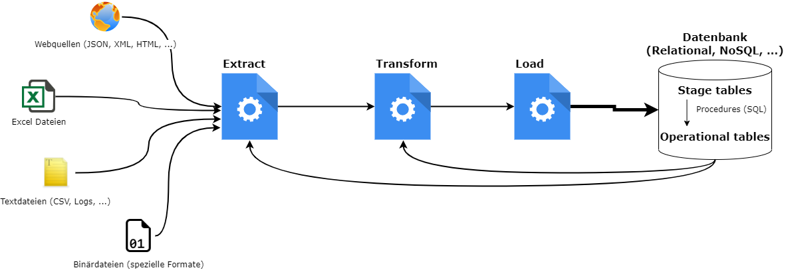
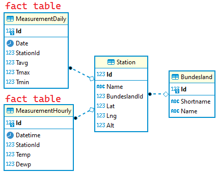

# Data Warehouse und ETL Prozesse

## Was ist ein Data Warehouse?

> Ein Data Warehouse (kurz DWH oder DW; wörtlich „Datenlager“, im Deutschen dominiert die englische
> Schreibweise, die Schreibweise Datawarehouse wird jedoch auch verwendet) ist eine für Analysezwecke
> optimierte zentrale Datenbank, die Daten aus mehreren, in der Regel heterogenen Quellen zusammenführt.
> <sup>(Erhard Rahm: Data Warehouses. (PDF) Einführung. S. 2, abgerufen am 29. September 2015 (Vorlesungsskript, Universität Leipzig))</sup>

Seit Beginn unserer Übung arbeiten wir zur Demonstration mit Wetterdaten. Die originalen Meldungen
sind Textdateien mit einem sehr speziellem Aufbau, dem [SYNOP Format](https://de.wikipedia.org/wiki/SYNOP#:~:text=Jeder%20SYNOP%2DCode%20besteht%20aus,Wetterstation%20oder%20eines%20Wetterschiffs%20dient.):

```
11034,2000,01,01,00,00,AAXX 01004 11034 46/// ///// 10000 21020 30034 40259=
11034,2000,01,01,03,00,AAXX 01034 11034 46/// ///// 10010 21012 30040 40264=
11034,2000,01,01,06,00,AAXX 01064 11034 46/// ///// 11002 21019 30045 40270 333 21009=
11034,2000,01,01,09,00,AAXX 01094 11034 46/// ///// 10005 21015 30051 40276=
11034,2000,01,01,12,00,AAXX 01124 11034 46/// ///// 10021 21011 30035 40258=
```

Wenn wir nun eine Wetterapp entwickeln wollen, die die vergangenen Messwerte anzeigt, werden wir
nicht bei jedem Request diese originalen Dateien parsen. Dies würde zu lange dauern. Wir müssen
daher die benötigte Information einmal extrahieren und eine eigene Datenbank damit befüllen.
Diese Datenbank liefert dann schnell die benötigten Werte für die Anzeige.

## Was ist ein ETL Prozess

Das Laden von externen Quellen in eine Datenbank ist sehr vielseitig. Der Prozess kann aber in 3
Grundschritte unterteilt werden:

- **Extract:** Zuerst müssen die originalen Daten geladen und die Information daraus extrahiert
  werden. Mit *read_csv()* geht das in einer Zeile, jedoch gibt es auch komplexere Formate.
  Meist liegen die Daten im Web, sodass ein Programm geschrieben werden muss, welches die Daten
  zuerst einmal abruft. Das Parsen kann durchaus aufwändig sein, vor allem wenn wir aus HTML Code
  die Information gewinnen wollen. Zudem gibt es noch (binäre) Spezialformate oder einfach
  Fließtextdateien. Ein Beispiel ist der Lehrplan im [RIS](https://www.ris.bka.gv.at/GeltendeFassung.wxe?Abfrage=Bundesnormen&Gesetzesnummer=20009288).
  Es kann durchaus vorkommen, dass wir zuerst aus unserer Datenbank Informationen lesen müssen, um
  z. B. den letzten eingetragenen Wert zu ermitteln, damit wir nicht unnötig Daten laden.
- **Transform:** Das Datenmodell in unserer Datenbank entspricht selten 1:1 den Rohdateien.
  Relationale Modelle liegen *normalisiert* vor. Wir müssen daher die Daten so transformieren,
  dass die Dataframes 1:1 in die Tabellen importiert werden können. Auch Fremdschlüssel, die in
  der Datenbank verwendet werden, müssen ggf. erst gelesen und die Daten daran angepasst werden.
- **Load:** Hier wird die eigentliche Arbeit gemacht, die Daten werden in die Datenbank gespielt.
  Dieses Prozess klingt zwar einfach, jedoch muss bei 1 Million Datensätzen auf die Performance
  geachtet werden. Spezielle an das DBMS angepasste Treiber und Optionen brauchen durchaus einiges
  an Recherche.

Grafisch kann der Prozess so dargestellt werden:



## Das Datenmodell der Wetterdaten DB

Wir können oft 2 Arten von Tabellen unterscheiden: Es gibt Tabellen, die die Messwerte speichern. Sie haben
sehr viele Datensätze und verweisen mittels Fremdschlüssel auf andere Datensätze. Dies bezeichnet man
als *fact tables*. Unsere Wetterdaten verweisen z. B. auf die konkrete Station. Diese Tabellen,
auf die verwiesen wird, nennt man *dimension tables*. Sie beinhalten im Vergleich zur fact table
nur wenige Datensätze und speichern die genaueren Informationen wie Seehöhe, Koordinaten, ...

Das Datenmodell unserer Wetterdatenbank, die wir befüllen wollen, besitzt 2 fact tables:



Streng genommen kann die Tabelle *MeasurementDaily* durch SQL aus *MeasurementHourly* gewonnen
werden. Allerdings würde die Datenbank zusammenbrechen, wenn bei jedem Request neu aggregiert wird.
Da sich die Werte in der Vergangenheit nicht ändern, wird die Aggregierung aus Performancegründen
in einer eigene Tabelle gespeichert.

## Konkretes Beispiel in [loader.ipynb](loader.ipynb)

Zuerst muss SQL Server und die Musterdatenbank vorhanden sein (siehe nächster Punkt). 
Im Notebook [loader.ipynb](loader.ipynb) beladen wir eine Datenbank mit unseren Wetterdaten.
Das Schema der Datenbank hat folgendes Aussehen:

## Vorbereitung

### SQL Server

Das Notebook [loader.ipynb](loader.ipynb) verwendet eine SQL Server 2019 Datenbank. Mit Docker kann
sehr einfach das SQL Server Image gestartet und ein Container erstellt werden.
Das Passwort für den User *sa* ist in diesem Befehl *SqlServer2019*.


```
docker run -d -p 1433:1433  --name sqlserver2019 -e "ACCEPT_EULA=Y" -e "SA_PASSWORD=SqlServer2019" mcr.microsoft.com/mssql/server:2019-latest      
```

Natürlich kann auch ein bestehender, installierter SQL Server 2019 verwendet werden. Der Zugriff
erfolgt dann mit *.\INSTANZNAME* statt mit der IP.

Danach verbinde dich mit DBeaver oder dem SQL Server Management Studio zur Datenbank (127.0.0.1 oder Instanzname)
und erstelle die Datenbank *Weatherdata*. Führe in dieser Datenbank den SQL Dump aus [weatherdata.sql](weatherdata.sql)
aus, um das Schema zu erstellen.

## Übungen

### Übung 1: Ergänzen des Loaders

#### Erstellen eines aufrufbaren Skriptes

Im Jupyter Notebool [loader.ipynb](loader.ipynb) wird die Funktionsweise erklärt. Der Loader soll
aber von der Konsole aufgerufen werden. Führe daher folgende Schritte durch:
1. Erstelle eine Datei *loader.py*. Es ist ein Python Skript, welches mit *python loader.py [year_to]*
   aufgerufen wird.
1. Übernimm die benötigten Codeteile aus dem Notebook, um die Datenbank beladen zu können. Das
   Skript soll natürlich die Datenbank nicht zur Gänze löschen, deswegen sind die *TRUNCATE TABLE*
   und *DELETE* Anweisungen nicht zu übernehmen. Du kannst diese Anweisungen zum Testen mit
   einem SQL Editor (DBeaver oder Management Studio) bei Bedarf absetzen.
2. Das Argument *year_to* wird beim Aufruf übergeben. Auf [dieser Seite](https://www.pythonforbeginners.com/system/python-sys-argv)
   gibt es Beispiele, wie das Argument in Python abgerufen werden kann.
3. Teste mit *python loader.py 2019*, ob alle Daten bis zum Jahr 2019 importiert wurden.
4. Teste mit *python loader.py*, ob alle Daten bis zum Jahr 2019 importiert wurden. Wenn kein Jahr
   angegeben wird, sollen einfach alle Daten geladen werden.

#### Befüllen der Tabelle *MeasurementDaily*

Das Notebook befüllt nur die Tabelle *MeasurementHourly*. Ergänze das erstellte Skript, sodass auch
die Tabelle *MeasurementDaily* befüllt wird. Durch das Wissen aus den vorigen Kapiteln (Data Wangling)
kann ein Dataframe erstellt werden, der eine lückenlose Tagesstatistik beinhaltet.

### Übung 2: Impfdaten

Auf [data.gv.at](https://www.data.gv.at/katalog/dataset/d230c9e8-745a-4da3-a3b4-86842591d9f0)
stehen die COVID-19 Impfdaten auf Gemeindeebene zur Verfügung. Die Textdatei hat folgenden
Aufbau:

```
date;municipality_id;municipality_name;municipality_population;dose_1;dose_2;dose_3;valid_certificates;valid_certificates_percent
2022-05-21T23:59:59+02:00;10101;Eisenstadt;15239;12236;11963;9445;10956;71.89448127
2022-05-21T23:59:59+02:00;10201;Rust;1985;1663;1636;1316;1501;75.61712846
2022-05-21T23:59:59+02:00;10301;Breitenbrunn am Neusiedler See;1890;1566;1550;1302;1465;77.51322751
2022-05-21T23:59:59+02:00;10302;Donnerskirchen;1846;1552;1527;1264;1441;78.06067172
```

Pro Tag werden also der Gemeindecode, der Name der Gemeinde, das Datum, die Gesamtbevölkerung und
die Anzahl der Personen mit einer 1., 2. oder 3. Impfung übertragen. In der Datei ist nur ein
Tag gespeichert, deswegen soll ein Skript geschrieben werden, welches immer zu einer gewissen Uhrzeit
aufgerufen werden kann.

Auf den Seiten von Statistik Austria (http://www.statistik.at/web_de/klassifikationen/regionale_gliederungen/gemeinden/index.html)
befindet sich die amtliche Liste aller Gemeinden. Die Datei
*Gemeinden sortiert nach Gemeindekennziffer mit Status und Postleitzahlen (CSV ca. 100KB)*
soll als Gemeindeverzeichnis in die Tabelle *Gemeinde* geladen werden. Die CSV Datei ist direkt auf
http://www.statistik.at/verzeichnis/reglisten/gemliste_knz.csv
abrufbar.

#### Schritt 1: Erstellen der Datenbank

Erstelle eine SQL Server Datenbank *Vaccination* und erstelle mit Hilfe des unten angeführten
SQL Skripts die notwendigen Tabellen.

#### Schritt 2: Erstellen des Loaderskripts

Erstelle ein Skript *loadVaccinations.py*. Das Skript soll auf 2 Arten aufgerufen werden können:

- *python loadVaccinations.py filename*: Liest die angegebene Dateien, statt aus dem Web zu laden. Es sollen
  auch Wildcards, also ein Aufruf mit *loadVaccinations.py \*.csv*, unterstützt werden.
- *python loadVaccinations.py*: Liest die Daten von *https://info.gesundheitsministerium.gv.at/data/COVID19_vaccination_municipalities.csv*

Dieses Skript soll folgendes erledigen:

- Lade die Gemeindedaten von Statistik Austria (URL http://www.statistik.at/verzeichnis/reglisten/gemliste_knz.csv). 
  Falls neue Gemeinden hinzukommen, sollen diese in der Tabelle *Gemeinde* eingetragen werden.
- Rufe das Skript mit *python loadVaccinations.py COVID19_vaccination_municipalities\*.csv* auf.
  Zum Testen liegt in der Datei [COVID19_vaccination_municipalities_20220521.csv](COVID19_vaccination_municipalities_20220521.csv)
  die Meldung vom 21.5. Es sollen auch mehrere Dateien gelesen und mit einem Importvorgang
  importiert werden können.
- In der Datenbank wird die Statistik pro Gemeinde gespeichert, in der Meldung des Gesundheitsministeriums
  wird pro Gemeindecode gemeldet. Der Unterschied ist nur in Wien sichtbar, denn es gibt für jeden
  Gemeindebezirk einen Gemeindecode. Die Daten sind daher pro Gemeindekennziffer zu aggregieren
  (bilde die Summe).
- Die Meldung des Gesundheitsministeriums liefert die Personen mit 1., 2. und 3. Impfung pro Zeile,
  im Datenmodell sind diese getrennt. Mit *[melt()](https://pandas.pydata.org/docs/reference/api/pandas.melt.html)*
  können Dataframes, die spaltenorientiert sind, in Zeilen umgewandelt werden.
- Belade die Tabelle *Vaccination* mit den übermittelten Werten. Da es keine Nachmeldungen gibt,
  müssen nur die Werte importiert werden, dessen Datum größer als das höchste Datum in der
  Tabelle *Vaccination* ist.
- Das Skript muss mehrmals hintereinander ohne Fehler ausführbar sein.
- Wird das Skript ohne Dateinamen aufgerufen, soll direkt aus dem Web geladen werden.
  Implementiere dieses Feature. Beim Aufruf von *loadVaccinations.py* sollten nun die neuen Daten in
  der Datenbank eingefügt werden.

In *loadVaccinations.py* weiter unten ist der Ladecode vorgegeben. Verwende diesen Code aus Ausgangsbasis
für dein Skript.

**impfungen.sql**
```sql
USE Vaccination;

CREATE TABLE Gemeinde (
    Id INT PRIMARY KEY,           -- Gemeindekennziffer
    Name VARCHAR(255) NOT NULL,   -- Gemeindename
    Population INT NOT NULL,
    UNIQUE(Name)
);

CREATE TABLE Vaccination (
    Id INT IDENTITY(1,1) PRIMARY KEY,
    GemeindeId INT,
    Date DATE,
    VaccNr INT NOT NULL,        -- 1 für 1. Impfung, 2 für 2. Impfung, 3 für 3. Impfung
    Count INT NOT NULL,         -- Anzahl der Personen mit 1., 2. oder 3. Impfung
    Population INT NOT NULL,
    UNIQUE (GemeindeId, Date, VaccNr),
    FOREIGN KEY (GemeindeId) REFERENCES Gemeinde(Id)
);
```

**loadVaccinations.py**
```python
import re, io, requests, glob, sys
import pandas as pd

def load_gemeinden_from_web():
    # Laden der Gemeinden von der Statistik Austria
    # Die Daten beginnen in der 3. Zeile (Kopfzeile). Damit die Fußzeile nicht geladen wird, filtern wir
    # nur nach gültigen Gemeindekennziffern. 
    gemeinden = pd.read_csv("http://www.statistik.at/verzeichnis/reglisten/gemliste_knz.csv",
        sep=";", header=2, encoding="utf8", usecols=["Gemeindekennziffer", "Gemeindename", "Gemeindecode"])
    gemeinden = gemeinden[gemeinden.Gemeindekennziffer.str.match("^[0-9]+$")]
    gemeinden["Gemeindekennziffer"] = gemeinden.Gemeindekennziffer.astype(int)
    gemeinden["Gemeindecode"] = gemeinden.Gemeindecode.astype(int)
    return gemeinden

def load_vaccinations_from_web():
    # Laden der Impfdaten
    # Da der SSL Key von info.gesundheitsministerium.gv.at für read_csv zu kurz ist, laden wir zuerst
    # mit requests die Daten und setzen davor entsprechende SSL Einstellungen.
    requests.packages.urllib3.disable_warnings()
    requests.packages.urllib3.util.ssl_.DEFAULT_CIPHERS = 'ALL:@SECLEVEL=1'
    response = requests.get("https://info.gesundheitsministerium.gv.at/data/COVID19_vaccination_municipalities.csv")
    vaccinations = pd.read_csv(io.BytesIO(response.content), sep=";")
    return vaccinations

def load_vaccinations_from_files(filter):
    vaccinations = None
    # Mit glob() können die Dateien aufgelistet werden, die einem Filter entsprechen.
    for file in glob.glob(filter):
        # TODO: CSV Datei in den Dataframe vaccination_file lesen
        vaccinations = vaccination_file if vaccinations is None else pd.concat([vaccinations, vaccination_file]) 

    return vaccinations

gemeinden = load_gemeinden_from_web()
# Das erste Argument lesen, wenn das Skript z. B. mit
#     python loadVaccinations.py Covid*.csv
# aufgerufen wird.
filter = None if len(sys.argv) < 2 else sys.argv[1]
# Der Dataframe mit allen Impfungen
vaccinations = load_vaccinations_from_files(filter) if filter is not None else load_vaccinations_from_web()

# TODO: Schreibe deinen Code
```

