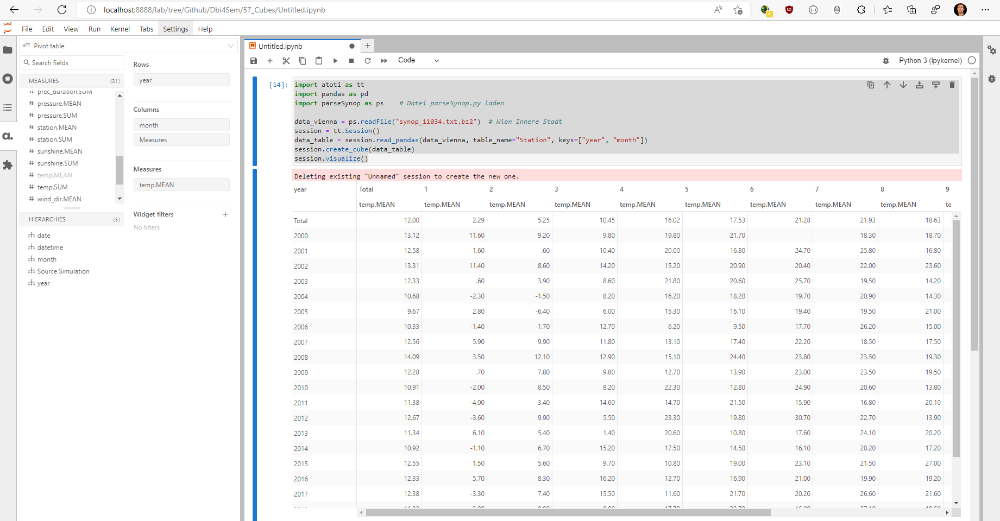

# CUBES

## Installation der Pakete

```
pip install jupyterlab --upgrade
pip install atoti[jupyterlab] --upgrade
``` 

## Starten von JupyterLab

JupyterLab ist eine Webanwendung, die im Browser geöffnet wird. Mit folgendem
Befehl in der Konsole startet der Server mit der Adresse *http://localhost:8888/*:

```
jupyter-lab
```

## Erstellen einer ersten Session



Lege in JupyterLab ein Notebook an und gib folgende Befehle ein. Achte darauf, dass die
referenzierten Dateien *[parseSynop.py](parseSynop.py)* und
*[synop_11034.txt.bz2](synop_11034.txt.bz2)* auch in diesem Verzeichnis sind):

```python
import atoti as tt
import pandas as pd
import parseSynop as ps    # Datei parseSynop.py laden

data_vienna = ps.readFile("synop_11034.txt.bz2")  # Wien Innere Stadt
session = tt.Session()
data_table = session.read_pandas(data_vienna, table_name="Station", keys=["year", "month"])
session.create_cube(data_table)
session.visualize()
```

Auf [docs.atoti.io](https://docs.atoti.io/latest/tutorial/tutorial.html#Getting-started) sind Möglichkeiten
erklärt, mit Cubes umzugehen.
