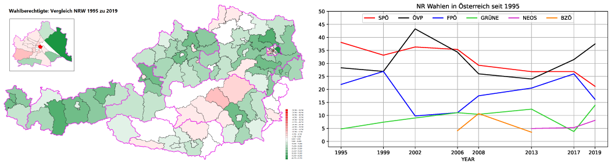

# Datasets für Data Science

## Wetterdaten der letzten 30 Jahre (1993-2022)

Seit 2022 sind die Wetterdaten von GeoSphere Austria (vormals ZAMG) unter https://data.hub.zamg.ac.at abrufbar.
In diesem Dataset befinden sich die Stundenmeldungen von 6 ausgewählten Wetterstationen der ZAMG:

| Id    | Name                  | Bundesland       | Lat [°]   | Lon [°]   | Altitude [m] |
|-------|-----------------------|------------------|-----------|-----------|--------------|
| 11082 | GUMPOLDSKIRCHEN       | Niederösterreich | 48.035833 | 16.280833 | 212          |
| 11180 | RAX/SEILBAHN-BERGSTAT | Niederösterreich | 47.7175   | 15.778611 | 1547         |
| 11343 | SONNBLICK - AUTOM.    | Salzburg         | 47.054167 | 12.9575   | 3109         |
| 11101 | BREGENZ               | Vorarlberg       | 47.499167 | 9.746111  | 424          |
| 11034 | WIEN-INNERE STADT     | Wien             | 48.198333 | 16.366944 | 177          |
| 11035 | WIEN/HOHE WARTE       | Wien             | 48.248611 | 16.356389 | 198          |

Im Dataset werden die folgenden meteorologischen Parameter gespeichet.
Beachte, dass Tmax nur um 18h UTC und Tmin nur um 6h UTC gemeldet wurde.
In neueren Datensätzen wird Tmax und Tmin (beide) um 6h unf 18h UTC gemeldet, da das Tagesmaximum bei Föhnlagen im Winter auch in der Nacht auftreten kann.

<details>
<summary>Anzahl der Tagesmeldungen pro Station anzeigen</summary>

| Jahr | 11034 | 11035 | 11082 | 11101 | 11180 | 11343 |
|------|-------|-------|-------|-------|-------|-------|
| 1993 | 362   | 365   | 362   | 365   | 0     | 0     |
| 1994 | 362   | 365   | 347   | 365   | 15    | 0     |
| 1995 | 363   | 365   | 363   | 365   | 348   | 0     |
| 1996 | 366   | 366   | 366   | 365   | 363   | 0     |
| 1997 | 358   | 365   | 364   | 365   | 359   | 117   |
| 1998 | 321   | 365   | 363   | 365   | 352   | 295   |
| 1999 | 360   | 365   | 362   | 364   | 356   | 329   |
| 2000 | 269   | 366   | 357   | 366   | 338   | 272   |
| 2001 | 357   | 365   | 352   | 365   | 338   | 278   |
| 2002 | 365   | 365   | 363   | 364   | 363   | 362   |
| 2003 | 359   | 365   | 360   | 364   | 348   | 358   |
| 2004 | 362   | 366   | 360   | 365   | 360   | 357   |
| 2005 | 365   | 365   | 365   | 364   | 358   | 362   |
| 2006 | 365   | 365   | 365   | 360   | 362   | 365   |
| 2007 | 365   | 365   | 363   | 363   | 365   | 364   |
| 2008 | 366   | 366   | 366   | 360   | 366   | 339   |
| 2009 | 361   | 365   | 360   | 360   | 363   | 357   |
| 2010 | 360   | 365   | 362   | 352   | 363   | 359   |
| 2011 | 365   | 365   | 365   | 365   | 362   | 365   |
| 2012 | 365   | 366   | 365   | 365   | 365   | 364   |
| 2013 | 365   | 365   | 365   | 364   | 365   | 361   |
| 2014 | 365   | 365   | 364   | 365   | 365   | 359   |
| 2015 | 364   | 365   | 364   | 365   | 365   | 365   |
| 2016 | 365   | 366   | 365   | 365   | 365   | 365   |
| 2017 | 365   | 365   | 365   | 365   | 365   | 365   |
| 2018 | 365   | 365   | 364   | 365   | 364   | 361   |
| 2019 | 364   | 365   | 365   | 364   | 365   | 359   |
| 2020 | 363   | 366   | 366   | 366   | 366   | 360   |
| 2021 | 365   | 365   | 365   | 364   | 364   | 363   |
| 2022 | 364   | 365   | 361   | 361   | 363   | 364   |
</details>

```
| Parameter | Bedeutung                                                  | Beschreibung                                                                                                                                                      | Einheit      |
|-----------|------------------------------------------------------------|-------------------------------------------------------------------------------------------------------------------------------------------------------------------|--------------|
| T         | Lufttemperatur                                             | Lufttemperatur                                                                                                                                                    | °C           |
| Tmax      | Maximum der Lufttemperatur                                 | Temperaturmaximum (12-stündig: 6 und 18 UTC), vormals SnTx                                                                                                        | °C           |
| Tmin      | Minimum der Lufttemperatur                                 | Temperaturminimum (12-stündig: 6 und 18 UTC, eventuell auch 15-stündig:   6, 9, 18 UTC), vormals SnTn                                                             | °C           |
| Td        | Taupunkttemperatur                                         | Taupunkt (bis 2001/06/19 tw. mit rel beschickt!)                                                                                                                  | °C           |
| rel       | Relative Feuchte                                           | Relative Luftfeuchte (bis 2001/06/19 = 254, nicht gemeldet)                                                                                                       | %            |
| dd        | Windrichtung                                               | Windrichtung  in Grad ,   990=umlaufender Wind (Code Table 0877)                                                                                                  | °            |
| ff        | Windgeschwindigkeit                                        | Windgeschwindigkeit in 1/10 m/s (wird umgerechnet, wenn Knoten: *5.14)                                                                                            | m/s          |
| Pg        | Luftdruck                                                  | Luftdruck in Stationsniveau, wenn <1000, dann 10000 hinzuaddiert                                                                                                  | hPa          |
| Pp        | Reduzierter Luftdruck                                      | Auf Meeresniveau reduzierter Luftdruck, wenn <1000, dann 10000   hinzuaddiert (1/10 hPa oder geopotentielle Meter)                                                | hPa          |
| RR3       | Niederschlagsmenge Sektion3                                | Niederschlagsmenge Sektion3 im Beobachtungszeitraum tr3 (0 = Spuren von   Nied., -1 = kein Nied.)                                                                 | mm           |
| RRR       | Niederschlagsmenge im Beobachtungszeitraum tr              | Niederschlagsmenge im Beobachtungszeitraum tr (0 = Spuren von Nied., -1 =   kein Nied.)                                                                           | mm           |
| tr        | Beobachtungszeitraum für Niederschlagsmenge                | Beobachtungszeitraum für Niederschlagsmenge RRR (Code Table 4019), Code   1=6std, 2=12std, 3=18std, 4=24std, 5=1std, 6=2std, 7=3std, 8=9std, 9=15std              | Code (Synop) |
| tr3       | Beobachtungszeitraum für Niederschlagsmenge RR3, Sektion 3 | Beobachtungszeitraum für Niederschlagsmenge RR3, Sektion 3 (Code Table   4019), Code 1=6std, 2=12std, 3=18std, 4=24std, 5=1std, 6=2std, 7=3std,   8=9std, 9=15std | Code (Synop) |
| sonne     | Sonnenscheindauer der letzten Stunde                       | Sonnenscheindauer in der vorangegangenen Stunde, Stundensumme                                                                                                     | h            |
```

### Dateien

- [zamg_weatherdata.csv.bz2](zamg_weatherdata.csv.bz2): UTF-8, Separator `;`, Header, CR+LF
- [zamg_weatherdata_unicode.csv.bz2](zamg_weatherdata_unicode.csv.bz2): UTF-16 (Unicode), Separator `;`, Header, CR+LF
- [zamg_weatherdata.parquet](zamg_weatherdata.parquet)

### Sample

```
| time                      |   station |    T |   Tmax |   Tmin |   Td |   rel |   dd |   ff |     Pg |     Pp |   RR3 |   RRR |   tr |   tr3 |   sonne |
|:--------------------------|----------:|-----:|-------:|-------:|-----:|------:|-----:|-----:|-------:|-------:|------:|------:|-----:|------:|--------:|
| 2010-10-12 13:00:00+00:00 |     11101 | 11.4 |  nan   |  nan   |  8.8 |   nan |  nan |    1 |  960.9 | 1012.5 |   nan |    -1 |  nan |   nan |     0.5 |
| 2002-01-17 09:00:00+00:00 |     11082 | -3.2 |  nan   |  nan   | -5.1 |   nan |  nan |    2 | 1001.8 | 1030.4 |   nan |    -1 |  nan |   nan |     0   |
| 2018-03-13 04:00:00+00:00 |     11035 |  9.2 |  nan   |  nan   |  3   |   nan |  nan |    5 |  977.9 | 1002.7 |   nan |    -1 |  nan |   nan |     0   |
| 2020-12-27 06:00:00+00:00 |     11034 | -0.9 |    1.6 |   -2.4 | -7.4 |   nan |  nan |    4 |  995.4 | 1017.8 |   nan |    -1 |    2 |   nan |     0   |
| 2014-05-25 00:00:00+00:00 |     11180 |  9.5 |  nan   |  nan   |  8.2 |   nan |  nan |   10 |  846.9 |  852.8 |   nan |     0 |    1 |   nan |   nan   |
```

### Quellen

- **ZAMG Data Hub:** https://data.hub.zamg.ac.at

## Bevölkerungsentwicklung in Österreich

In diesem Dataset befindet sich der Stand der Österreichischen Bevölkerung mit Stichtag 1.1.2022.

### Dateien

- [population.csv.bz2](population.csv.bz2): UTF-8, Separator `;`, Header, CR+LF
- [population_unicode.csv.bz2](population_unicode.csv.bz2): UTF-16 (Unicode), Separator `;`, Header, CR+LF
- [population.parquet](population.parquet)

### Sample

```
|   Population | GenderNameDe   | GenderNameEn   |   GenderId |   CityKennziffer | CityName    | CityBezirk         | CityBundesland   |   CityArea |   CityLongitude |   CityLatitude |   AgeValue | AgeRange5   | AgeRange10   |
|-------------:|:---------------|:---------------|-----------:|-----------------:|:------------|:-------------------|:-----------------|-----------:|----------------:|---------------:|-----------:|:------------|:-------------|
|            2 | weiblich       | female         |          2 |            80118 | Raggal      | Bludenz            | Vorarlberg       |     41.564 |         9.89958 |        47.2002 |         88 | 85-89       | 80-89        |
|           16 | weiblich       | female         |          2 |            41507 | Großraming  | Steyr-Land         | Oberösterreich   |    108     |        14.5539  |        47.8826 |         33 | 30-34       | 30-39        |
|            8 | weiblich       | female         |          2 |            10724 | Zurndorf    | Neusiedl am See    | Burgenland       |     54.255 |        17.011   |        47.9787 |         45 | 45-49       | 40-49        |
|           37 | männlich       | male           |          1 |            30626 | Pottendorf  | Baden              | Niederösterreich |     39.762 |        16.3859  |        47.9149 |         70 | 70-74       | 70-79        |
|           23 | männlich       | male           |          1 |            31901 | Altlengbach | Sankt Pölten(Land) | Niederösterreich |     35.542 |        15.9358  |        48.1482 |         61 | 60-64       | 60-69        |
```

**Population:** Anzahl der Personen mit diesem Alter.
**GenderNameDe:** *männlich/weiblich*
**GenderNameEn:** *male/female*
**GenderId:** 1 für *male*, 2 für *female*.
**CityKennziffer:** Amtliche Gemeindekennziffer. Eindeutig pro Gemeinde (City). In Wien gilt jeder Gemeindebezirk als Gemeinde (Kennzahl *9xx01*).
**CityName:** Name der politischen Gemeinde. In Wien der Name des Gemeindebezirkes.
**CityBezirk:** Politischer Bezirk oder Gemeindebezirk (in Wien).
**CityBundesland:** Bundesland.
**CityArea:** Fläche in km².
**CityLongitude:** Längengrad in GPS Koordinaten (WGS84).
**CityLatitude:** Breitengrad in GPS Koordinaten (WGS84).
**AgeValue:** Alter in Jahren (18 bedeutet 18 - 18.99 Jahre).
**AgeRange5:** Altersgruppe bei einer Einteilung in 5er Schritten.
**AgeRange10:** Altersgruppe bei einer Einteilung in 10er Schritten.

### Quellen

- **Population 2022:** https://www.data.gv.at/katalog/dataset/688b289e-ab72-3ef0-ab7e-b8dc0d2c21d1
- **Verwaltungsgrenzen:** https://www.bev.gv.at/Services/Downloads/Produktbezogene-Downloads/Unentgeltliche-Produkte/Kataster-Verzeichnisse.html
- **Bezirksgrenzen Wien:** https://www.data.gv.at/katalog/dataset/stat_gliederung-osterreichs-in-politische-bezirke131e2

## Grundwasserspiegel in NÖ ab 2009

In diesem Dataset befinden sich die Tagesmittelwerte der Grundwasserspiegel aus dem Messnetz des Hydrografischen Dienstes in NÖ.
Zeitraum: 2009 - 2022 (inkl.).

### Dateien

- [grundwasserspiegel_noe.csv.bz2](grundwasserspiegel_noe.csv.bz2): UTF-8, Separator `;`, Header, CR+LF
- [grundwasserspiegel_noe_unicode.csv.bz2](grundwasserspiegel_noe_unicode.csv.bz2): UTF-16 (Unicode), Separator `;`, Header, CR+LF
- [grundwasserspiegel_noe.parquet](grundwasserspiegel_noe.parquet)

### Sample

```
|   StationNumber | StationName                 |   StationLatitude |   StationLongitude | StationCatchment   |   StationHeight |   StationNgw |   StationHgw | Datum               |    Wert |   GwLevel |
|----------------:|:----------------------------|------------------:|-------------------:|:-------------------|----------------:|-------------:|-------------:|:--------------------|--------:|----------:|
|          331991 | Enzersdorf im Thale, Bl 419 |           48.5825 |            16.2428 | ---                |          264.41 |       259.02 |       261.8  | 2011-08-06 00:00:00 | 259.92  |    -4.49  |
|          337170 | St.Peter in der Au, Bl 438  |           48.0423 |            14.612  | Donau              |          361.01 |       339.72 |       341.74 | 2019-04-26 00:00:00 | 340.287 |   -20.723 |
|          331496 | Mauer bei Amstetten, Bl 364 |           48.068  |            14.7907 | ---                |          310.27 |       290.84 |       295.35 | 2019-11-28 00:00:00 | 291.083 |   -19.187 |
|          337048 | Leobendorf, Blt 425         |           48.3601 |            16.3002 | Donau              |          168.35 |       162.92 |       167.35 | 2012-05-08 00:00:00 | 163.728 |    -4.622 |
|          304683 | Gänserndorf, Bl             |           48.3451 |            16.7231 | March              |          153.53 |       149.86 |       152.38 | 2010-03-26 00:00:00 | 150.88  |    -2.65  |
```

**StationNumber:** Eindeutige Nummer der hydrografischen Station.
**StationName:** Name der Station.
**StationLatitude:** Breitengrad der Station in GPS (WGS84) Koordinaten.
**StationLongitude:** Längengrad der Station in GPS (WGS84) Koordinaten.
**StationCatchment:** Einflussbereich eines Flusses (Optional).
**StationHeight:** Seehöhe der Station in m über Adria.
**StationNgw:** Niederster, jemals gemessene Grundwasserstand in m über Adria.
**StationHgw:** Höchster, jemals gemessene Grundwasserstand in m über Adria.
**Datum:** Tag, für den der Messwert gilt.
**Wert:** Tagesmittel des Grundwasserspiegels in m über Adria.
**GwLevel:** Höhe des Grundwasserspiegels in m in Relation zur Stationshöhe. Negativer Wert.

### Quellen

- **Hydrografischer Dienst NÖ:** https://www.noel.gv.at/wasserstand/#/de/Messstellen/Map/Grundwasserspiegel

## Ergebnisse der Nationalratswahlen seit 1995 auf Gemeindeebene



In diesem Dataset befinden sich die Ergebnisse der Nationalratswahlen seit 1995.
Es beinhaltet die abgegebenen Stimmen auf Gemeindeebene. 
Wahlkarten werden den Regionalwahlkreis zugewiesen.
Briefwahlkarten werden den Bezirken zugewiesen.

### Dateien

- [nrw_ergebnisse.csv.bz2](nrw_ergebnisse.csv.bz2): UTF-8, Separator `;`, Header, CR+LF
- [nrw_ergebnisse_unicode.csv.bz2](nrw_ergebnisse_unicode.csv.bz2): UTF-16 (Unicode), Separator `;`, Header, CR+LF
- [nrw_ergebnisse.parquet](nrw_ergebnisse.parquet)

### Sample

```
|   YEAR |   GKZ_BEV | Partei   |   BKZ_BEV |   BLKZ | PG                        | PB       | BL               | WKNR_BEV   | WKNAME                 |   AREA |   CENTER_X |   CENTER_Y |   Wahlberechtigte |   StimmenAbgegeben |   StimmenGueltig |   StimmenUngueltig |   Stimmen |   StimmenAbgegebenMitWk |   StimmenGueltigMitWk |   StimmenUngueltigMitWk |   StimmenMitWk | Parteibezeichnung                           |
|-------:|----------:|:---------|----------:|-------:|:--------------------------|:---------|:-----------------|:-----------|:-----------------------|-------:|-----------:|-----------:|------------------:|-------------------:|-----------------:|-------------------:|----------:|------------------------:|----------------------:|------------------------:|---------------:|:--------------------------------------------|
|   2013 |     32141 | BZÖ      |       321 |      3 | Zwentendorf an der Donau  | Tulln    | Niederösterreich | 3D         | Niederösterreich Mitte | 53.752 |    15.8809 |    48.3513 |              3003 |               2220 |             2177 |                 43 |        57 |                2452.41  |              2405.67  |                46.7345  |      62.6604   | BZÖ - Liste Josef Bucher                    |
|   2017 |     61021 | ÖVP      |       610 |      6 | Lebring-Sankt Margarethen | Leibnitz | Steiermark       | 6C         | Weststeiermark         |  7.602 |    15.5332 |    46.8503 |              1680 |               1182 |             1177 |                  5 |       369 |                1375.21  |              1369.35  |                 5.86401 |     438.73     | Liste Sebastian Kurz - die neue Volkspartei |
|   2017 |     70519 | GILT     |       705 |      7 | Niederndorferberg         | Kufstein | Tirol            | 7C         | Unterland              | 12.129 |    12.2341 |    47.6697 |               484 |                316 |              315 |                  1 |         0 |                 356.924 |               355.783 |                 1.14077 |       0.473736 | Liste Roland Düringer - Meine Stimme GILT   |
|   2008 |     40425 | LIF      |       404 |      4 | Moosdorf                  | Braunau  | Oberösterreich   | 4B         | Innviertel             | 15.725 |    12.9795 |    48.0438 |              1211 |                842 |              796 |                 46 |         5 |                 912.832 |               865.395 |                47.4369  |       6.39693  | Liberales Forum                             |
|   2002 |     32141 | GRÜNE    |       321 |      3 | Zwentendorf an der Donau  | Tulln    | Niederösterreich | 3D         | Niederösterreich Mitte | 53.752 |    15.8809 |    48.3513 |              2682 |               2338 |             2282 |                 56 |        81 |                2405.42  |              2348.8   |                56.615   |      88.503    | Die Grünen - Die Grüne Alternative          |
```

**YEAR:** Wahljahr (1995, 1999, 2002, 2006, 2008, 2013, 2017, 2019)
**GKZ_BEV:** Gemeindekennzahl der Statistik Austria aus dem Datensatz des BEV (Bundesamt für Eich- und Vermessungswesen).
Sie ist immer 5stellig und hat den Aufbau LBBGG (L = Bundesland, B = Bezirk, G = Gemeinde).
**Partei:** Kürzel der wahlwerbenden Partei (SPÖ, ÖVP, ...)
**BKZ_BEV:** Bezirkskennzahl, abgeleitet aus der Gemeindekennzahl (LBB).
**BLKZ:** Bundesland Kennzahl, abgeleitet aus der Gemeindekennzahl (L).
**PG:** Name der politischen Gemeinde. In Wien wird der Name des Gemeindebezirkes verwendet.
**PB:** Name des politischen Bezirkes. In Wien wird der Name des Gemeindebezirkes verwendet.
**BL:** Name des Bundeslandes
**WKNR_BEV:** Kennzahl des Wahlkreises (1A = Burgenland Nord, ...).
Ein Wahlkreis umfasst mehrere Bezirke im selben Bundesland.
**WKNAME:** Name des Wahlkreises.
**AREA:** Fläche der Gemeinde in km².
**CENTER_X:** Längengrad des Mittelpunktes der Gemeinde in WGS84 (GPS) Koordinaten.
**CENTER_Y:** Breitengrad des Mittelpunktes der Gemeinde in WGS84 (GPS) Koordinaten.
**Wahlberechtigte:** Anzahl der Wahlberechtigten der Gemeinde.
**StimmenAbgegeben:** Anzahl der abgegebenen Stimmen der Gemeinde.
**StimmenGueltig:** Anzahl der abgegebenen gültigen Stimmen der Gemeinde.
**StimmenUngueltig:** Anzahl der abgegebenen ungültigen Stimmen der Gemeinde.
**Stimmen:** Anzahl der Stimmen für die angegebene Partei der Gemeinde.
**StimmenAbgegebenMitWk:** Anzahl der abgegebenen Stimmen, wobei die Wahlkarten und Briefwahlkarten aliquot zugeteilt werden.
Deswegen ist diese Zahl auch nicht ganzzahlig.
**StimmenGueltigMitWk:** Anzahl der abgegebenen gültigen Stimmen, wobei die Wahlkarten und Briefwahlkarten aliquot zugeteilt werden.
Deswegen ist diese Zahl auch nicht ganzzahlig.
**StimmenUngueltigMitWk:** Anzahl der abgegebenen ungültigen Stimmen, wobei die Wahlkarten und Briefwahlkarten aliquot zugeteilt werden.
Deswegen ist diese Zahl auch nicht ganzzahlig.
**StimmenMitWk:** Anzahl der Stimmen für die angegebene Partei der Gemeinde, wobei die Wahlkarten und Briefwahlkarten aliquot zugeteilt werden.
Deswegen ist diese Zahl auch nicht ganzzahlig.
**Parteibezeichnung:** Langbezeichnung der Partei.

### Quellen

- **NRW 1995:** https://www.bmi.gv.at/412/Nationalratswahlen/Nationalratswahl_1995_Wiederholungswahl_1996/start.aspx
- **NRW 1999:** https://www.bmi.gv.at/412/Nationalratswahlen/Nationalratswahl_1999/start.aspx
- **NRW 2002:** https://www.bmi.gv.at/412/Nationalratswahlen/Nationalratswahl_2002/start.aspx
- **NRW 2006:** https://www.bmi.gv.at/412/Nationalratswahlen/Nationalratswahl_2006/start.aspx
- **NRW 2008:** https://www.bmi.gv.at/412/Nationalratswahlen/Nationalratswahl_2008/start.aspx
- **NRW 2013:** https://www.bmi.gv.at/412/Nationalratswahlen/Nationalratswahl_2013/start.aspx
- **NRW 2017:** https://www.bmi.gv.at/412/Nationalratswahlen/Nationalratswahl_2017/start.aspx
- **NRW 2019:** https://www.bmi.gv.at/412/Nationalratswahlen/Nationalratswahl_2019/start.aspx
- **Umcodierung der Gemeindekennziffern Niederösterreich:** https://www.data.gv.at/katalog/dataset/7f759371-bdb3-4f58-9dbd-835eb3c19efa
- **Die neue Gemeinde- und Bezirksstruktur in der Steiermark:** https://www.landesentwicklung.steiermark.at/cms/beitrag/12658686/141979478/
- **Land Steiermark: Gebietsstands- und Namensänderungen 2020:** https://www.landesentwicklung.steiermark.at/cms/dokumente/12658757_142970621/716b52c0/STMK%20Gebietsstands%C3%A4nderungen%20GM%202020.pdf


## Ergebnisse der NÖ Landtagswahlen seit 1993

In diesem Dataset befinden sich die Ergebnisse der NÖ Landtagswahlen seit 1993.
Es beinhaltet die abgegebenen Stimmen auf Gemeindeebene.
Da Wahlkarten und Briefwahlkarten in den Wahlkreisen bzw. Bezirken einlangen und nicht auf Gemeindeebene ausgewiesen werden, sind nur die auf Gemeindeebene ausgezählten Stimmen erfasst.

### Dateien

- [ltw_noe.csv.bz2](ltw_noe.csv.bz2): UTF-8, Separator `;`, Header, CR+LF
- [ltw_noe_unicode.csv.bz2](ltw_noe_unicode.csv.bz2): UTF-16 (Unicode), Separator `;`, Header, CR+LF
- [ltw_noe.parquet](ltw_noe.parquet)

### Sample

```
| Typ   |   Jahr |   GemeindeKennzahl | Crated              |   Wahlberechtigte |   WahlberechtigteMale |   WahlberechtigtFemale |   StimmenGesamt |   StimmenGesamtUngueltig |   StimmenGesamtGueltig | Partei   |   Stimmen | GemeindeName   | GemeindeBezirk   | GemeindeBundesland   |   GemeindeArea |   GemeindeLongitude |   GemeindeLatitude | ParteiName                                     |
|:------|-------:|-------------------:|:--------------------|------------------:|----------------------:|-----------------------:|----------------:|-------------------------:|-----------------------:|:---------|----------:|:---------------|:-----------------|:---------------------|---------------:|--------------------:|-------------------:|:-----------------------------------------------|
| L     |   2013 |              31833 | 2013-03-08 10:51:19 |               720 |                   351 |                    369 |             475 |                        5 |                    470 | FPÖ      |        42 | Schottwien     | Neunkirchen      | Niederösterreich     |         12.552 |             15.8666 |            47.6389 | Freiheitliche Partei Österreichs               |
| L     |   2023 |              31613 | 2023-01-31 14:57:21 |               978 |                     0 |                      0 |             795 |                       29 |                    766 | NEOS     |        48 | Gnadendorf     | Mistelbach       | Niederösterreich     |         48.318 |             16.3752 |            48.6045 | NEOS – Das Neue Österreich und Liberales Forum |
| L     |   2018 |              31015 | 2018-01-31 12:27:36 |              1800 |                   887 |                    913 |            1261 |                       25 |                   1236 | ÖVP      |       750 | Hadres         | Hollabrunn       | Niederösterreich     |         34.468 |             16.136  |            48.7094 | Österreichische Volkspartei                    |
| L     |   2023 |              31838 | 2023-01-31 14:57:21 |               372 |                     0 |                      0 |             280 |                        8 |                    272 | FPÖ      |        55 | Semmering      | Neunkirchen      | Niederösterreich     |          8.719 |             15.8215 |            47.6423 | Freiheitliche Partei Österreichs               |
| L     |   2008 |              30612 | 2008-03-20 07:11:22 |              1371 |                   642 |                    729 |             971 |                       16 |                    955 | KPÖ      |        11 | Günselsdorf    | Baden            | Niederösterreich     |          6.608 |             16.2745 |            47.9352 | Kommunistische Partei Österreichs              |
```

- **Typ:** Typ der Wahl. Immer *L* (für Landtagswahl).
- **Jahr:** Jahr der Wahl.
- **GemeindeKennzahl:** 5stellige Kennzahl der Gemeinde der Statistik Austria (1. Stelle: Bundesland, 1. - 3. Stelle: Bezirk).
- **Crated:** Erstelldatum des Datensatzes.
- **Wahlberechtigte:** Anzahl der Wahlberechtigten in dieser Gemeinde. Ist bei allen Parteien pro Jahr natürlich gleich.
- **WahlberechtigteMale:**  Anzahl der männl. Wahlberechtigten in dieser Gemeinde. Ist bei allen Parteien pro Jahr natürlich gleich.
- **WahlberechtigtFemale:**  Anzahl der weibl. Wahlberechtigten in dieser Gemeinde. Ist bei allen Parteien pro Jahr natürlich gleich.
- **StimmenGesamt:**  Anzahl der abgegebenen Stimmen in dieser Gemeinde. Ist bei allen Parteien pro Jahr natürlich gleich.
- **StimmenGesamtUngueltig:** Anzahl der abgegebenen ungültigen Stimmen in dieser Gemeinde. Ist bei allen Parteien pro Jahr natürlich gleich.
- **StimmenGesamtGueltig:** Anzahl der abgegebenen gültigen Stimmen in dieser Gemeinde. Ist bei allen Parteien pro Jahr natürlich gleich.
- **Partei:** Kurzname der Partei (ÖVP, SPÖ, ...). Wurde homogenisiert, d. h. alle Jahre hat die selbe Partei den selben Namen.
- **Stimmen:** Anzahl der Stimmen für diese Partei.
- **GemeindeName:** Name der Gemeinde.
- **GemeindeBezirk:** Name des politischen Bezirkes der Gemeinde.
- **GemeindeBundesland:** Name des Bundeslandes der Gemeinde.
- **GemeindeArea:** Fläche der Gemeinde in km².
- **GemeindeLongitude:** Längengrad des Mittelpunktes der Gemeinde in WGS84 (GPS) Koordinaten.
- **GemeindeLatitude:** Breitengrad des Mittelpunktes der Gemeinde in WGS84 (GPS) Koordinaten.
- **ParteiName:** Langname der Partei. Wurde homogenisiert, d. h. alle Jahre hat die selbe Partei den selben Namen.


### Quellen

- **Landtagswahlen seit 1998:** https://www.noel.gv.at/noe/Wahlen/Landtagswahlen.html
- **Verwaltungsgrenzen:** https://www.bev.gv.at/Services/Downloads/Produktbezogene-Downloads/Unentgeltliche-Produkte/Kataster-Verzeichnisse.html
- **Umcodierung der Gemeindekennziffern Niederösterreich:** https://www.data.gv.at/katalog/dataset/7f759371-bdb3-4f58-9dbd-835eb3c19efa

