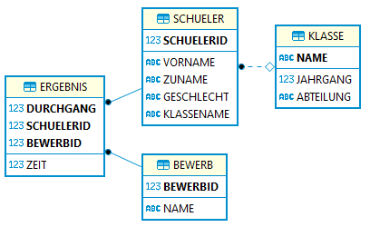
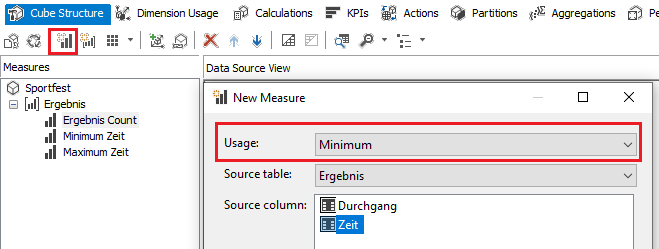
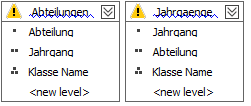

# Aufgabenstellung zu SQL*Loader und Analysis Services

## Generieren der Datenbank und der Importdatei

Synchronisieren Sie zuerst das Git Repository in einen Ordner. Sie können auch alternativ die
Datei [Sportfest.zip](Sportfest.zip) laden, sie beinhaltet ebenfalls alle Daten.

Öffnen Sie die Konsole und gehen Sie in das Verzeichnis Sportfest. In diesem Verzeichnis muss
die Programmdatei (*Sportfest.csproj*) liegen. Führen Sie das Programm mit dem Befehl
*dotnet run -c Release* aus. Sie sehen die folgenden Ausgaben:

```text
...\Sportfest>dotnet run -c Release
    Verbinde als User System (Passwort oracle) zur Oracle DB und lege den User Sportfest an.
    Verbinde als User Sportfest (Passwort oracle) zur Oracle DB und lege die Tabellen an.
    Schreibe die TXT Datei in ergebnisse.txt
    Verbinde mit dem Windows User zu SQL Server und lege die DB Sportfest an.
    Gratulation, es hat alles funktioniert :)))
```

## Datenbank

Als Datenbank wird die Sportfest Datenbank verwendet, die auch bei den analytischen Funktionen
verwendet wurde:



Die Tabellen *Schueler*, *Bewerb* und *Klasse* sind schon befüllt. Diese Tabellen müssen nicht
im Rahmen der Loader Aufgabenstellung bearbeitet werden.

## Oracle SQL Loader

In der Datei [ergebnisse.txt](ergebnisse.txt) befinden sich Daten, die Sie mit SQL Loader in die
Tabelle *Ergebnis* importieren sollen. Kopieren Sie diese Datei in den gemeinsamen Virtual Box
Ordner. Beachten Sie, dass die Tabelle *Ergebnis* bereits Daten
beinhaltet. Führen Sie daher die folgenden Schritte durch:

**(1)** Erstellen Sie eine Tabelle *ERGEBNIS_STAGE*. Sie hat das selbe Schema wie die Tabelle
Ergebnis:

```sql
CREATE TABLE ERGEBNIS_STAGE (
    DURCHGANG  NUMBER(10,0) NOT NULL,
    SCHUELERID NUMBER(10,0) NOT NULL,
    BEWERBID   NUMBER(10,0) NOT NULL,
    ZEIT       NUMBER(6,2) NOT NULL,
    PRIMARY KEY (SCHUELERID, BEWERBID, DURCHGANG)
);
```

**(2)** Erstellen Sie ein Controlfile mit dem Namen *ergebnis.ctl*. Es soll die Datei
[ergebnisse.txt](ergebnisse.txt) in die Tabelle *ERGEBNIS_STAGE* importieren. Die Textdatei ist
UTF-8 codiert und hat den Tabulator als Trennzeichen zwischen den Spalten. Die Zeilenumbrüche
entsprechen dem Windows Standard (CR+LF).

Beachten Sie, dass die Textdatei Spalten hat, die Sie nicht in die Tabelle Ergebnis importieren
sollen (der Namen des Schülers und des Bewerbes). Diese Informationen sind bereits in den
entsprechenden Tabellen gespeichert.

Das Controlfile soll so gestaltet sein, dass SQL Loader auch mehrfach ohne Fehlermeldung aufgerufen
werden kann. Der Befehl zum Aufrufen des Programmes SQL Loader lautet

```text
sqlldr userid=Sportfest/oracle control=ergebnis.ctl
```

Da das Controlfile unter Linux ausgeführt wird, muss es Linux Zeilenumbrüche (LF) verwenden.

**(3)** Schreiben Sie eine SQL Anweisung, die die neu hinzugekommenen Daten aus der Tabelle
*ERGEBNIS_STAGE* in die Tabelle *Ergebnis* einfügt. Sie erkennen neue Datensätze daran, dass der
Schlüsselwert (eine Kombination aus Schüler, Bewerb und Durchgang) noch nicht in der Tabelle *Ergebnis*
vorkommt. Andere Operationen wie das Entfernen oder Ändern von Daten sind nicht vorgesehen. Am Ende
müssen 720 Datensätze in der Tabelle *Ergebnis* vorliegen.

## Analysis Services

Erstellen Sie mit Visual Studio 2019 ein Projekt vom Typ *"Analysis Services Multidimensional and Data
Mining Project"* und nennen es *Sportfest*. Führen Sie danach folgende Schritte durch.

**(1)** Erzeugen Sie ein Star Model: Die Tabelle *Schueler* verweist auf die Tabelle *Klasse*. Da wir ein
Modell brauchen, wo alle Schülerinformationen in einer Tabelle vereint sind, erstellen Sie in der
SQL Server Datenbank *Sportfest* eine View *vSchuelerDimension*:

```sql
CREATE VIEW vSchuelerDimension AS
SELECT s.*, k.Jahrgang, k.Abteilung
FROM Schueler s INNER JOIN Klasse k ON (s.KlasseName = k.Name);
```

**(2)** Vergessen Sie nicht, bei den Eigenschaften des Projektes Sportfest den Server
*.\SQLSERVER2019* statt *localhost* als Ziel einzustellen.

**(3)** Verbinden Sie sich als Data Source zur SQL Server Datenbank *Sportfest*.

**(4)** Erstellen Sie danach eine Data Source View mit den Tabellen *Bewerb*, *Ergebnis* und der View
*vSchuelerDimension*. Achten Sie darauf, dass Sie die Beziehungen und logischen Schlüssel korrekt
setzen.

**(5)** Erstellen Sie einen Cube mit der Fact Table *Ergebnis* und den Dimension Tables
*Bewerb* und *vSchuelerDimension*. Fügen Sie danach 2 neue Measures hinzu: Ein Measure *Minimum Zeit*,
welches das Minimum der Zeit ermittelt. Ein weiteres Measure lautet *Maximum Zeit* für die höchste
Zeit. Sie können Measures in Visual Studio mit dem Buttion *New Measure* leicht hinzufügen:



**(6)** Passen Sie die Dimension *vSchuelerDimension* so an, dass Sie die folgenden 2 Hierarchien
*Abteilungen* und *Jahrgaenge* anbieten:



## Abgabe

Erstellen Sie einen Ordner mit ihrem Accountnamen. Kopieren Sie

- das Control File für SQL Loader (Dateiname *ergebnis.ctl*) direkt in diesen Ordner.
- die SQL Datei mit dem INSERT Statement in die Tabelle Ergebnis (Dateiname *import_stage.sql*) direkt
  in diesen Ordner.
- den vollständigen Ordner *Sportfest* mit Ihrem Visual Studio Projekt (liegt standardmäßig auf *C:\Users\username\source\repos*). Achten Sie darauf, dass die *sln* Datei ebenfalls mitkopiert wird. Ohne die sln
  Datei kann Ihre Visual Studio Abgabe nicht bewertet werden.

Komprimieren Sie nun den Ordner mit Ihrem Accountnamen und benennen die ZIP Datei ebenfalls nach
Ihrem Accountnamen. Geben Sie dann die ZIP Datei auf Teams ab.

### Bewertung

Für die Aufgabenstellung werden 16 Punkte vergeben.

- Das Control File *ergebnis.ctl* ist korrekt und erlaubt den (mehrmaligen) Import in die Tabelle *ERGEBNIS_STAGE*. (6 P)
- Die SQL Anweisung in *import_stage.sql* importiert die neuen Daten in die Tabelle Ergebnis. (2 P)
- Die Data Source View umfasst die korrekten Objekte mit den erforderlichen Referenzen und
  logischen Schlüsseln. (2 P)
- Der Cube beinhaltet die angegebenen Measures (Minimum und Maximum der Zeit). (2 P)
- Der Cube beinhaltet die Dimensionen *Bewerb* und *vSchuelerDimension*. (2 P)
- Die Hierarchien für *vSchuelerDimension* wurden korrekt angelegt. (2 P)

## Ergänzung für den 4. Juni 2020

### Importaufgabe

Importieren Sie die Datei [schueler.txt](schueler.txt) in die Tabelle *Schueler*. Schreiben Sie
dafür ein Control File, welches über den SQL Loader die Daten in dieser Textdatei an die Tabelle
anfügt. Beim erneuten Import wird dieser natürlich fehlschlagen, da die Primärschlüsselwerte schon
vorhanden sind. Das ist gewollt und in Ordnung.

### Analysis Services

Erstellen Sie für die Dimension vSchuelerDimension eine zusätzliche Hierarchie, die eine Auswertung
nach Jahrgang (1. Stufe) und Geschlecht (2. Stufe) ermöglicht. Bauen Sie danach in den Cube ein
Measure ein, welches die durchschnittliche Zeit ausgibt.
