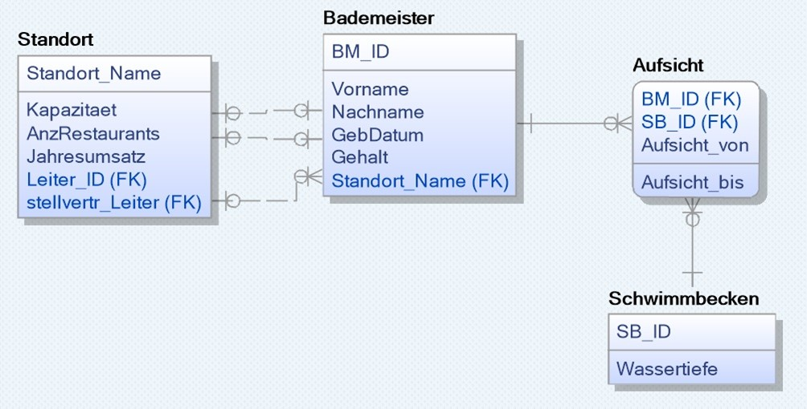

# DBI Matura für die AIF/KIF

Stand: 14. Februar 2023, Änderungen vorbehalten

## Aufbau der Fragen, Thema ziehen 

Sie ziehen 2 Themen aus dem Pool (6 Themen). Sie wählen dann ein Thema aus. Danach teilt Ihnen der Prüfer 
die Frage zu. Danach gehen Sie zu einem Vorbereitungs-PC und bereiten die Frage ca. 30 Minuten vor. Sie 
können, müssen aber keine Folien erstellen. Mit diesen Folien gehen Sie zur Prüfung. Die Prüfung dauert in 
der Regel 12 Minuten. 

Die Fragen haben immer folgenden Aufbau: 

- **Reproduktion:** Theoriewissen (z. B. Aufbau von XML erklären, ...) 
- **Transfer:** Anhand eines konkreten Beispieles (Modelles) eine Frage beantworten. 
- **Reflexion:** Anwendung auf ähnliche Themenbereiche. 

## Themenpools 

### 1 Abfragesprachen (SQL, PL/SQL) bei HIK/SZ

Siehe https://github.com/schletz/dbi1sem, https://github.com/schletz/dbi2sem, https://github.com/schletz/dbi3sem

- SQL Statements für ein gegebenes Modell erstellen können. Es steht nur PowerPoint zur Verfügung,
  daher muss nicht jeder Beistrich syntaktisch korrekt sein. Es muss der Aufbau des Statements
  aber korrekt sein.
- Functions und Procedures in PL/SQL erklären können und den Aufbau der Deklaration können.
- Die use-cases und Arten von Triggern beherrschen und einen einfachen Trigger schreiben können. Beispiele:
  Befüllen einer log Tabelle, Änderung von Werten beim INSERT/UPDATE, ...

### 2 Alternative Datenhaltung (XML, JSON, MongoDB und noSQL)

Siehe https://github.com/schletz/Dbi3sem 

- **XML Format:** Aufbau, Datentypen, "wohlgeformt", Vor- und Nachteile verschiedener Files 
- **JSON Format:** Aufbau, Datentypen, Modelklassen, Abfragebeispiele 
- **Dokumentbasierende NoSQL Datenbanken (MongoDB)**
    - Was ist eine Collection? Was ist ein Document? 
    - Schemaentwurf wie auf
   https://github.com/schletz/Dbi3Sem/blob/master/13_NoSQL/Uebungen%20Modelling/Terminverwaltung.md: Collections identifizieren, Document, Embedding, Referencing 
    - Relational vs. NoSQL (ER Diagramm in ein Schema transformieren):
    Ein ER Diagramm wird gegeben, entwerfen Sie ein Schema für eine NoSQL Datenbank. 
    - Eine Collection mit *find()* und *aggregate()* abfragen können.
    - Updates: SQL Update vs. NoSQL Update mit eingebetteten Daten. Beispiel: Der Lehrer wird als 
    Klassenvorstand in das Document *Class* eingebettet. Der Lehrer ändert seine Email Adresse. Was ist zu tun? "Update Anomalie". 

### 3 Architekturen und Administration von Datenbanksystemen bei HIK 

### 4 Business Intelligence

siehe https://github.com/schletz/Dbi4Sem 

#### ETL Prozess 

- Stagetabellen 
(https://github.com/schletz/Dbi4Sem/blob/master/13_IncrementalLoad/README.md) 
- Was ist ein ETL Prozess? (https://github.com/schletz/Dbi4Sem/blob/master/56_ETL/README.md) 

#### SQL*Loader

siehe  https://github.com/schletz/Dbi4Sem/blob/master/12_SqlLoader/README.md

- Welche Möglichkeiten gibt es, Daten zu importieren? 
- Welche Probleme gibt es beim Import von Textdateien? 
- Konvertierungen (Datum, Zahlen, ...) 

#### Cubes und Star Model

- Videos auf https://github.com/schletz/Dbi4Sem unter "Business Intelligence"
- Grundoperatopnen in Cubes (https://de.wikipedia.org/wiki/OLAP-W%C3%BCrfel) 
- Star Model (siehe Videos) 

### 5 Datenmodelle und Datenbankanwendungen bei HIK 

### 6 Desktop Datenbanken 

- Filedatenbank:
    - Was sind die Eigenschaften und Vorteile?
    - Was kann sie nicht? Multiuser, Berechtigungen, Verursachen Locking der DB, Transaktionen 
- Probleme beim Mehrbenutzerzugriff? 
- Features (Rechte, ...) 
- Probleme mit Datenschutz? 
- Migration in ein DBMS (Oracle, SQL Server) 
    - Server, Zugriff auf den Server (auch über Internet) 
    - Import der Daten 
    - Zugriff aus einem Programm heraus 

## Beispielfrage aus dem Bereich Abfragesprachen

In der Beilage finden Sie ein Datenbankmodell, auf welches sich alle nachfolgenden Aufgabenstellungen beziehen.

**Reproduktion**
- Erklären Sie den grundlegenden Aufbau einer CREATE TABLE Anweisung.
- Welche Datentypen stehen bei der Definition von Attributen zur Verfügung?
- Erklären Sie den Begriff CONSTRAINTS und welche Arten es gibt inkl. deren Verwendungszweck.

**Transfer (SQL-Statements)**
- Erstellen Sie für die Tabelle “Standort“ eine CREATE TABLE Anweisung inkl. Definition des Primary Keys und der Foreign Keys.
- Wählen Sie für jedes Attribut einen passenden Datentyp
- Fügen Sie der Tabelle 2 CONSTRAINTS hinzu welche sicherstellt, dass beim Attribut “Kapazitaet“ ein Wert eingetragen werden muss und beim Attribut „AnzRestaurants“ nur Werte von 1 bis 4 eingetragen werden können.

**Reflexion**
Angenommen, Sie müssten die CREATE TABLE Anweisungen auch für die restlichen Tabellen erstellen. Können Sie diese Anweisungen in einer beliebigen Reihenfolge ausführen? Wovon ist die Reihenfolge abhängig? Unter welchen Voraussetzungen könnten Sie beispielsweise die Tabelle “Aufsicht“ als erstes erstellen?  

### Beilage: Datenmodell

